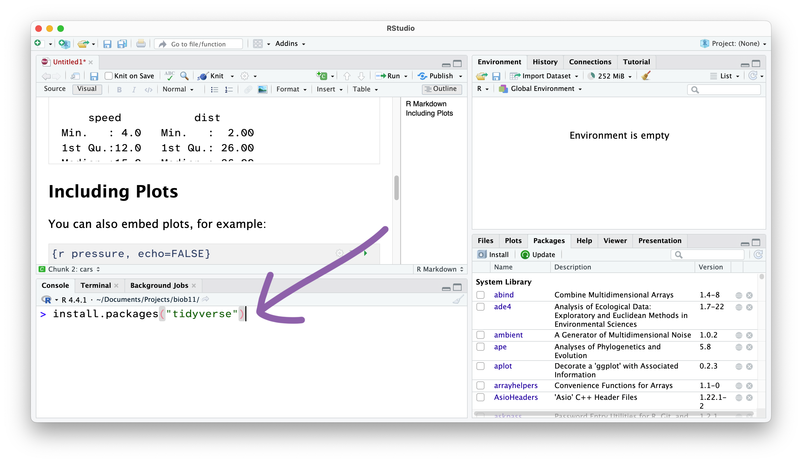



# What is R?

R is a powerful, open-source programming language specifically designed for statistical computing, data analysis, and
visualization.

## How do I use R?

R can be used in a number of ways. In the next exercise session, we will install R on your computer, along with Rstudio,
which is a friendly user interface for R. In this exercise, you will use R in your browser to explore its capabilities.

Note that once the webpage has loaded, you can edit the code in any of the boxes below (I strongly encourage you to do
this!). Press the "Run code" button to run the code you have written. You will learn a lot through experimenting, and
you can always reset the code box back to its original state with the "Start over" button.

# Introduction to R

## R as a calculator

R, like most programming languages, can perform arithmetic operations. It follows the order of operations used in
mathematics. If you want to review that, you can do so [in Chapter 1 of
@duthie2025](https://bradduthie.github.io/stats/Chapter_1.html#order-of-operations).

You can use the following operators to write equations in R:

- `+` : Addition
- `-` : Subtraction
- `*` : Multiplication
- `/` : Division
- `^` or `**` : Exponentiation
- `%%` : Modulus (remainder from division)
- `%/%` : Integer division

Use these to solve the questions below.

::: {.callout-note icon="false"}
## ✅ Task

Fill in the blank so that the result of the sum is 10. You need to delete the `______` and replace it with a number.

:::

```{webr}
#| exercise: ex_1_1
1 + 2 + 3 + ______
```

```{webr}
#| exercise: ex_1_1
#| check: true
if (identical(.result, 10)) {
  list(correct = TRUE, message = "Nice work!")
} else {
  list(correct = FALSE, message = "That's incorrect, sorry.")
}
```

::: {.callout-note icon="false"}
## ✅ Task

Fill in the blank so that the result of the sum is 12.

:::

```{webr}
#| exercise: ex_1_2
______ + 64 / 8
```

```{webr}
#| exercise: ex_1_2
#| check: true
if (identical(.result, 12)) {
  list(correct = TRUE, message = "Nice work!")
} else {
  list(correct = FALSE, message = "That's incorrect, sorry.")
}
```

::: {.callout-note icon="false"}
## ✅ Task

Fill in the blank so that the result of the sum is 81.

:::

```{webr}
#| exercise: ex_1_3
(3 + ______) * 9
```

```{webr}
#| exercise: ex_1_3
#| check: true
if (identical(.result, 81)) {
  list(correct = TRUE, message = "Nice work!")
} else {
  list(correct = FALSE, message = "That's incorrect, sorry.")
}
```

## Programming concepts

While it is not required to be an experienced computer programmer to use R, there is still a set of basic programming
concepts that new R users need to understand. We will cover these first. You do not need to memorise these things.

### Objects

In R, data can be stored in objects. An object can be thought of as a container that holds data. You can create an
object by assigning a value to a name using the assignment operator `<-`. In the example below, I assign the value `5`
to the object `x`, and the value `10` to the object `y`. We can then perform maths or other operations using these
objects.

::: {.callout-note icon="false"}
## ✅ Task

Calculate the sum of `x` and `y` using `+` on the line below.

:::

```{webr}
#| exercise: ex_objects_1
x <- 5
y <- 10
```
::: { .solution exercise="ex_objects_1" }
```r
x <- 5
y <- 10
x + y
```
:::

```{webr}
#| exercise: ex_objects_1
#| check: true
if (identical(.result, 15)) {
  list(correct = TRUE, message = "Nice work!")
} else {
  list(correct = FALSE, message = "That's incorrect, sorry.")
}
```

::: {.callout-note icon="false"}
## ✅ Task

Add a third object called `z` and assign it the value `12`. Write a math equation that will output the value `24`, using
`x`, `y`, and `z` only.

:::

```{webr}
#| exercise: ex_objects_2
x <- 5
y <- 10
```
::: { .solution exercise="ex_objects_2" }
```r
x <- 5
y <- 10
z <- 12

y / x * z
```
:::

```{webr}
#| exercise: ex_objects_2
#| check: true
if (identical(.result, 24)) {
  list(correct = TRUE, message = "Nice work!")
} else {
  list(correct = FALSE, message = "That's incorrect, sorry.")
}
```

Objects can hold any sort of data in R. It could be a single value like in the above example, multiple values, text, a
whole dataset, or a plot.

### Data types

In R, data can come in various types, and it's important to understand these types to manipulate and analyse data
effectively. Here are some of the most common data types in R:

- **Numeric**: Represents numbers and can be either integers or floating-point numbers. For example, `42` and `3.14` are
  numeric values.
- **Character**: Represents text or string data. Character values are enclosed in quotes, such as `"Hello, world!"`.
- **Logical**: Represents boolean values, which can be either `TRUE` or `FALSE`.
- **Factor**: Used to represent categorical data. Factors are useful for storing data that has a fixed number of unique
  values, such as "Species A" and "Species B" for species ID.

Note that these are similar, but conceptually different, to the variables types we covered in the lecture. However, the
variable types we covered are often encoded in R using these data types:

- **Categorical variables:**
  - **Nominal**: we will generally use either a `character` or a `factor` data type. If used in a statistical test or to
    make a plot, `character` data is usually automatically converted to a `factor`. If your nominal variable is
    represented by a number (e.g., Forest `1`,`2`,`3`...), then it is usually best to explicitly convert it to either a
    `character` or a `factor`.
  - **Ordinal**: must be a `factor`, as you can set the order of the levels witin the factor to the intended order. By
    default, the order will be determined by alpha-numeric order (A,B,C, 1,2,3).
- **Quantitative variables**
  - **Discrete**: `numeric`, and specifically, an `integer`. R will infer the type of numeric data (`integer` or
    `double` (with decimal)) from the data.
  - **Continuous**: `numeric`, and specifically, a `double`.

### Vectors

Vectors are one of the most basic data structures in R. A vector is a sequence of data elements of the same basic type.
We will sometimes directly use vectors in this course, so it will be good to be familiar with them.

- **Creating Vectors**: You can create a vector using the `c()` function, which stands for "combine" or "concatenate".
  For example, here I create 3 vectors, and assign them to different objects:

```{webr}
#| autorun: true
numeric_vector <- c(1, 2, 3, 4, 5)
character_vector <- c("gorilla", "chimpanzee", "human")
logical_vector <- c(TRUE, FALSE, TRUE)
```

**Accessing Elements**: You can access elements (position) of a vector using square brackets `[]`. For example, to
access the second element of `character_vector`:

```{webr}
character_vector[2]
```

Note that in R, the first position is `[1]`, not `[0]` like in some programming languages.

**Vector Operations**: You can perform operations on vectors. These operations are applied element-wise. For example:

```{webr}
numeric_vector * 2
```

Note that every value in the vector gets multiplied and returned.

**Vector Length**: You can find the length (number of values in it) of a vector using the `length()` function:

```{webr}
length(numeric_vector)
```

### Dataframes

Dataframes are like spreadsheets. They have rows and columns, and all columns are the same length. These are the primary
way we will represent data in this course.

| species  | mass_g | sex    |
| -------- | ------ | ------ |
| blue_tit | 9.1    | male   |
| blue_tit | 10.6   | male   |
| sparrow  | 27.3   | female |

We will come back to them soon.

### Boolean and logical operators

Boolean operators are used to perform logical operations and return boolean values (`TRUE` or `FALSE`). We will use them
in this course to describe our hypotheses. Here are the most common boolean operators in R:

- **Comparison Operators**: These operators compare two values and return a boolean value.
  - `==` : Equal to
  - `!=` : Not equal to
  - `<` : Less than
  - `>` : Greater than
  - `<=` : Less than or equal to
  - `>=` : Greater than or equal to

For example, this bit of code should evaluate to `TRUE`:

```{webr}
1 + 2 == 3
```

And this should be `FALSE`:

```{webr}
a <- 12
b <- 13

a > b
```

::: {.callout-note icon="false"}
## ✅ Task

Use the operators above to fill in the blanks below such that the code will evaluate to `TRUE`.

:::

```{webr}
#| exercise: ex_boolean_1
100 ______ 100
```
::: { .solution exercise="ex_boolean_1" }
```r
100 == 100
```
:::

```{webr}
#| exercise: ex_boolean_1
#| check: true
if (identical(.result, TRUE)) {
  list(correct = TRUE, message = "Nice work!")
} else {
  list(correct = FALSE, message = "That's incorrect, sorry.")
}
```

```{webr}
#| exercise: ex_boolean_2
p <- ______

8 + p == 56
```
::: { .solution exercise="ex_boolean_2" }
```r
p <- 48

8 + p == 56
```
:::

```{webr}
#| exercise: ex_boolean_2
#| check: true
if (identical(.result, TRUE)) {
  list(correct = TRUE, message = "Nice work!")
} else {
  list(correct = FALSE, message = "That's incorrect, sorry.")
}
```

```{webr}
#| exercise: ex_boolean_3
q <- 24
r <- 88

q + ______ > r
```
::: { .solution exercise="ex_boolean_3" }
```r
q <- 24
r <- 88

q + 65 > r #<1>
```
1. Any number > 64 will work.
:::

```{webr}
#| exercise: ex_boolean_3
#| check: true
if (identical(.result, TRUE)) {
  list(correct = TRUE, message = "Nice work!")
} else {
  list(correct = FALSE, message = "That's incorrect, sorry.")
}
```

We can now add in some logical operators:

- **Logical Operators**: These operators are used to combine multiple boolean expressions.
  - `&` : Logical AND
  - `|` : Logical OR
  - `!` : Logical NOT

For example, this bit of code should evaluate to `TRUE`, because both the first part `1 + 3 == 4` and the second part
`5 >= 4` is `TRUE`:

```{webr}
(1 + 3 == 4) & (5 >= 4)
```

Whereas this evaluates to `FALSE`, because only the first part is `TRUE`:

```{webr}
(1 + 3 == 4) & (5 == 4)
```

But if we change the `&` to an OR operator `|`, it evaluates to `TRUE` because at least one part of it is `TRUE`:

```{webr}
(1 + 3 == 4) | (5 == 4)
```

::: {.callout-note icon="false"}
## ✅ Task

Use the operators above to fill in the blanks below such that the code will evaluate to `TRUE`.

:::

```{webr}
#| exercise: ex_boolean_4
fruit_a <- "apple"
fruit_b <- "banana"

(fruit_a != fruit_b) ______ (1.5 > 1.2)
```
::: { .solution exercise="ex_boolean_4" }
```r
fruit_a <- "apple"
fruit_b <- "banana"

(fruit_a != fruit_b) & (1.5 > 1.2) #<1>
```
1. OR `|` would also work here.
:::

```{webr}
#| exercise: ex_boolean_4
#| check: true
if (identical(.result, TRUE)) {
  list(correct = TRUE, message = "Nice work!")
} else {
  list(correct = FALSE, message = "That's incorrect, sorry.")
}
```

```{webr}
#| exercise: ex_boolean_5
fruit_a <- "apple"
fruit_b <- "banana"

(fruit_a == fruit_a) ______ (35 + 12 > 47)
```
::: { .solution exercise="ex_boolean_5" }
```r
fruit_a <- "apple"
fruit_b <- "banana"

(fruit_a == fruit_a) | (35 + 12 > 47)
```
:::

```{webr}
#| exercise: ex_boolean_5
#| check: true
if (identical(.result, TRUE)) {
  list(correct = TRUE, message = "Nice work!")
} else {
  list(correct = FALSE, message = "That's incorrect, sorry.")
}
```

### Functions

Functions perform tasks in R. Functions can take inputs, called *arguments*, and return outputs. We put the *arguments*
inside the brackets. For example, in R there is a function called `mean()`. This function's first argument `x` should be
a vector of `numeric` data. The function then outputs the mean as a single `numeric` value. For example, here we assign
a vector of tree heights (cm) to an object called `trees`. We then calculate the mean tree height using the `mean()`
function.

```{webr}
trees <- c(1.86, 2.56, 1.14, 2.66, 1.91, 2.61, 2.03, 1.5, 2.36, 1.57)

mean(x = trees)
```

Note that if we are going to supply *arguments* in the order that the function expects them, we do not have to tell the
function which object is for each argument. Since `mean()` expects the first argument to be the vector you want the mean
of, we can also write:

```{webr}
mean(trees)
```

To find out what a function can do, and its arguments, use can write `?function_name`, and the R helpfile will be
returned for that function (e.g., `?mean`). These helpfiles can be confusing at first, but the more you use R, the more
they will make sense.

We will work with functions a lot in this course, so don't worry if it still seems confusing.

### Pipes

One of the final concepts I will introduce is the pipe operator `|>`. Note that you will often see it written as `%>%`
when searching online. This is for historical reasons (R by default did not have a pipe operator until recently, so
people had made their own). `|>` comes with R by default now, while `%>%` requires you to load a package called
`magrittr` first (we will cover packages soon).

Pipes allow you to write code in a way that often makes more sense to people, especially non-programmers. To explain,
here's an example. Note that this is not real code, so you cannot run it.

Say I wanted to run 3 different functions on a dataframe called `my_data`. The functions are `function_1()`,
`function_2()`, and `function_3()`. Imagine `function_1()` first transforms my data into the right scale, `function_2()`
then performs a statistical test, and `function_3()` then makes a plot (again, these are not real functions, just for
the example).

I could write that in a few ways. The first way would look like this:

```{r}
#| echo: true
#| eval: false
my_data_1 <- function_1(my_data) # <1>
my_data_2 <- function_2(my_data_1) # <2>
my_data_final <- function_3(my_data_2) # <3>
```

1. The original data, `my_data`, is passed to `function_1()`, and the result is stored in `my_data_1`.
2. The transformed data, `my_data_1`, is then passed to `function_2()`, and the result is stored in `my_data_2`.
3. Finally, the data from `my_data_2` is passed to `function_3()`, and the result is stored in `my_data_final`.

While this method is quite clear to read, it creates a lot of objects that we might not want to do anything with. This
is not a huge issue, but could become one if you are working with very large data sets.

We could also write it like this:

```{r}
#| echo: true
#| eval: false
my_data_final <- function_3(function_2(function_1(my_data)))
```

We can wrap functions within functions to put this whole operation on one line. This gets rid of those extra objects,
having only a `my_data_final` as the output. However, the order in which the functions are written no longer matches the
order in which they are run. In the above example, `function_1()` runs first, then `function_2()`, then `function_3()`.
But they are written in reverse order when we read it left to right.

A final method of writing this makes use of pipes `|>`, and has the best of both approaches:

```{r}
#| echo: true
#| eval: false
my_data_final <- my_data |> function_1() |> function_2() |> function_3()
```

Pipes also allow us to spread our code over multiple lines, and the `|>` will look for the next bit of code on the next
line if nothing comes after it:

```{r}
#| echo: true
#| eval: false
my_data_final <- 
  my_data |> 
  function_1() |> 
  function_2() |> 
  function_3()
```

All the above examples have the same `my_data_final` output, but are just written in different ways. The computer reads
them all identically, so the main benefit is how readable your code is.

In this course, we will use pipes extensively, along with a set of packages that are designed for this kind of workflow.

::: {.callout-note icon="false"}
## ✅ Task

Below, rewrite the examples to use pipes. You can check the solutions tab to see if you are on the right track.

:::

```{webr}
#| exercise: ex_pipes_1
trees <- c(1.86, 2.56, 1.14, 2.66, 1.91, 2.61, 2.03, 1.5, 2.36, 1.57)

mean(trees)
```

::: { .solution exercise="ex_pipes_1" }
```r
trees |> mean()                                 #<1>
```
1. Take the `trees` vector, and then pipe`|>` it into the `mean()` function.
:::

The `log()` function performs a natural logarithm transformation of the data.

```{webr}
#| exercise: ex_pipes_2
trees <- c(1.86, 2.56, 1.14, 2.66, 1.91, 2.61, 2.03, 1.5, 2.36, 1.57)

mean(log(trees))
```

::: { .solution exercise="ex_pipes_2" }
```r
trees |>                                  #<1>
  log() |>
  mean() 
```
1. Take the `trees` vector, and then pipe`|>` it into the `log()` function, then into the `mean()` function.
:::

### Packages

An R package is a set of functions, data and/or information that someone else has written, that you can first load, then
use in your own R code. Packages are written by other R users, and distributed for free via repositories, like The
Comprehensive R Archive Network (CRAN).

R packages are often used to save you time. While all the functions in an R package are written with R, and you could
write them again yourself, why bother? If someone else has done it already and shared it, fantastic! In this course, we
are going to use two package "families". They are `tidyverse` and `tidymodels`. Note that both start with tidy. Remember
from the lecture, that tidy refers to a particular format of data, and these packages all assume your data will be in
the format, and will always return data in that format. They are also all built with pipes in mind, and are designed to
make complex programming tasks (especially those performed by data scientists, of which biology fits in well) very easy.
We will cover these packages in detail soon, but know to use them you need to do two things:

1. Install the package. This needs to be done once on your computer, using the `install.packages()` command. For
   examples:

```{r}
#| echo: true
#| eval: false
install.packages("ggplot2")
```

This will install `ggplot2`, a package for plotting data. It will install it from CRAN by default, and probably
(assuming you are in Sweden) will be downloaded from a server in Umeå.

2. We now need to load the package, so that we can access it while we write code. To do that, we use the `library()`
   function.

```{r}
#| echo: true
#| eval: false
library(ggplot2) # <1>
```

1. Note that we no longer require the `"` around the package name. But the function would still work if you did include
   them.

Below I have written some code that makes a plot using an inbuilt R dataset called `iris` using the package `ggplot2`.
But if you try to run it, you will get an error. The `ggplot2` package has already been installed, so fix the code by
loading the `ggplot2` package before the code that makes the plot.

```{webr}
#| setup: true
#| exercise: ex_packages_1

install.packages("ggplot2")
```

```{webr}
#| exercise: ex_packages_1

iris |>
  ggplot(aes(x = Sepal.Length, y = Sepal.Width, colour = Species)) +
  geom_point()
```

::: { .solution exercise="ex_packages_1" }
```r
library(ggplot2)                                  #<1>

iris |>
  ggplot(aes(x = Sepal.Length, y = Sepal.Width, colour = Species)) +
  geom_point()
```
1. Make sure to load the `ggplot2` package before the `ggplot()` function. Code is always executed top to bottom.
:::

That was a lot of concepts in a very short amount of time! Take a break before the next section.

# Running R locally

Follow the [guide](../install_r.qmd) on how to install R and RStudio on your computer. Once they're both installed,
return to this section.

## Welcome to *RStudio*

::: {.callout-note icon="false"}
## ✅ Task

Launch RStudio.

:::

It should detect your R installation automatically, but if not, a window will open asking you to select it. If R does
not appear here, I suggest you restart your computer first.

You should be met by a scene that looks like this:


Rstudio is designed around a four panel layout. Currently you can see three of them. To reveal the fourth, go to *File*
-> *New file* -> *R markdown..*. This will open an RMarkdown document, which is a form of coding "notebook", where you
can mix text, images and code in the same document. We will use these sorts of documents extensively in this course.
Give your document a title like "BIOB11 Exercise 4". You can put your name for author, and leave the rest as default for
now. Click OK. Now your window should look something like this:


1. **Source**: This is where we edit code related documents. Anything you want to be able to save should be written
   here.
2. **Console**: the console is where R lives. This is where any command you write in the source pane and run will be
   sent to be executed.
3. **Environments**: this panel shows you objects loaded into R. For example, if you were to assign a value to an object
   (e.g.`x <- 1`), then it would appear here.
4. **Output**: this panel has many functions, but is commonly used to navigate files, show plots, show a rendered
   RMarkdown file or to read the R help documentation.

### RMarkdown

RMarkdown is a file format for making dynamic documents with R. It combines plain text with embedded R code chunks that
are run when the document is rendered, allowing you to include results *and* your R code directly in the document. This
makes it a powerful tool for creating reproducible analyses, which are extremely important in science.

The RMarkdown document you opened has some example text and code. An RMarkdown document consists of three main parts:

1. **YAML Header**: This section, enclosed by `---` at the beginning and end, contains metadata about the document, such
   as the title, author, date, and output format.

2. **Text**: You can write plain text using Markdown syntax to format it. Markdown is a lightweight markup language with
   plain text formatting syntax, which is easy to read and write.

3. **Code Chunks**: These are sections of R code enclosed by triple backticks and `{r}`. You can click the green arrow
   to run all the code in a code chunk, or run each line of code using the *Run* button, or by using `Ctrl+Enter`
   (Windows) or Cmd+Enter (macOS)When the document is rendered, the code is executed, and the results are included in
   the output.

Notice at the top left of the *Source* panel, there are two buttons: *Source* and *Visual*. These allow you to switch
betwee two views of the RMarkdown document. The *Source* view is what you are looking at, and it is the raw text
document. You can also use the *Visual* view, which allows you to work in a WYSIWYG (what you see is what you get) view,
similar to Microsoft Office or other text editors. This "renders" your markdown code for you while you write. It also
gives you a series of menus to help you format text, which means you do not need to learn [how to write markdown
code](https://rmarkdown.rstudio.com/authoring_basics.html) (although it is extremely simple, and you likely know some
already).

Which ever view you prefer (and you can switch as often as you like), the code part stays the same. It is primarily
there for editing the text around your code.

### Important settings

Before we go any further, we need to change some default settings in RStudio.

::: {.callout-note icon="false"}
## ✅ Task

Go to *Tools* -> *Global Settings*, then:

1. Go to the *General* tab.
    i) **Un-tick** "*Restore .RData into workspace at startup*"
   ii) Set "*Save workspace to RData on exit:*" to *Never*.
2. Go to the *Code* tab
   i) **Tick** "*Use native pipe operator, l> (requires R 4.1+)*"

:::

While we are here, if you wanted to change the font size or theme, you can do that in the *Appearance* tab.

RStudio also has screenreader support. You can enable that in the *Accessibility* tab.

### Working directory

**I strongly recommend you create a folder where you save all the work you do as part of this course.** I also recommend
you make this folder in a part of your computer that is **not** being synced with a cloud service (iCloud, OneDrive,
Google Drive, Dropbox, etc). These services can cause issues with RStudio. You can always backup your work at the end of
a session.

::: {.callout-note icon="false"}
## ✅ Task

Within your new course folder, I also want you to **make a new folder for each exercise we do**. This will make it
easier for you to stay organsied. It also makes your code reproducible by simply sending someone the contents of the
folder in question. For example, this is exercise 2, so my main folder might be called `biob11`, and within that folder
I might make a folder called `exercise_2`.

We now want to set our *working directory* to this `biob11/exercise_2` folder. A working directory is the directory
(folder) in a file system where a user is currently working. It is the default location where all your R code will be
executed and where files are read from or written to unless specified otherwise. To set the working directory using
RStudio, go to *Session* -> *Set working directory* -> *Choose directory*, then navigate to the folder you just made for
this exercise. You should do this at the start of each exercise.

:::

Notice that now in your *Output* pane, in the *files* tab, you can see the contents of your folder (which is probably
nothing currently). Let's change that.

### Saving your document

Let's save this example RMarkdown document that RStudio has made for us. You do that exactly how you might expect.

::: {.callout-note icon="false"}
## ✅ Task

Go to *File* -> *Save*, or use the floppy disc icon. Ensure you save it in your working directory with a descriptive
name (e.g. `exercise_2.Rmd`).
:::

The file should have appeared in your *Output* pane, with the extension `.Rmd`.

### Installing R packages

In this course, we will use the `tidyverse` package, and the `infer` package. To install them you need to use the
`install.packages()` function. Since we only need to do this once per computer, we should run this function directly in
the *Console* panel.

::: {.callout-note icon="false"}
## ✅ Task

Type or copy the install function into the *console*, and press enter to run:
:::

```{r}
#| echo: true
#| eval: false
install.packages("tidyverse")
install.packages("infer")
```



Let's also install the package that contained the penguin data we used in the first exercise.

::: {.callout-note icon="false"}
## ✅ Task

Type or copy the install function into the *console*, and press enter to run:
:::

```{r}
#| echo: true
#| eval: false
install.packages("palmerpenguins")
```

From now on, we won't write things directly in the *Console*, and instead write code in the RMarkdown document in the
*Source* panel, which we then "Run" and send the *Console*.

### Creating code cells

Code cells are where we write code in an RMarkdown document. This allows use to write normal text outside these
sections.

::: {.callout-note icon="false"}
## ✅ Task

In your *Source* panel, in the RMarkdown document, add a R code cell.

:::

::: {.callout-note collapse="true" icon="false"}
### Visual view

To do that in the *Visual view* (where the text is rendered), go to *Insert* -> *Executable Cell* -> *R*.


:::

::: {.callout-note collapse="true" icon="false"}
### Source view

To do that in the *Source view* (where we see just plain text), we use three back-ticks (```` ``` ````) to mark the
start and end of a code cell. Additionally at the start, we declare the language used by enclosing it in two curly
brackets `{r}`.

````markdown
```{{r}}

```
````
:::

In both views, you can also use the shortcut *Shift-Alt-I* or *Shift-Command-I*.

### Loading R packages

After installing an R package, we need to load it into our current R environment. We use the `library()` function to do
that. Since we need this code to run every time we come back to this RMarkdown document, we should write it in the
document. R code should always be executed "top to bottom", so this bit of code should come right at the start.

::: {.callout-note icon="false"}
## ✅ Task

Inside that code cell you just made, use the `library()` function to load the `tidyverse`, `infer` and `palmerpenguins`
packages:

(To run code in the *Source* panel, you can click on the line you want to run, and then press the "Run" button. Or you
can also use the keyboard shortcut `Ctrl+Enter` or `Cmd+Return`.)
:::

```{r}
#| echo: true
#| eval: false
library(tidyverse)
library(infer)
library(palmerpenguins)
```

If that worked, you will get a message that reads something similar to:

```{r}
#| echo: false
#| eval: true
library(tidyverse)
library(infer)
library(palmerpenguins)
```

This message tells us which packages were loaded by the `tidyverse` package, and which functions from base R (the
functions that come with R by default) have been overwritten by the `tidyverse` packages. Not all packages produce a
message when they are loaded (for example, `infer` and `palmerpenguins` did not).

### Final task

::: {.callout-note icon="false"}
## ✅ Task

Can you recreate one of the plots from the [first exercise](01_eda.qmd)? Once you have, you should
upload a screenshot of your RStudio as the [assignment](https://canvas.education.lu.se/courses/39432/assignments) for
this exercise session.
:::
