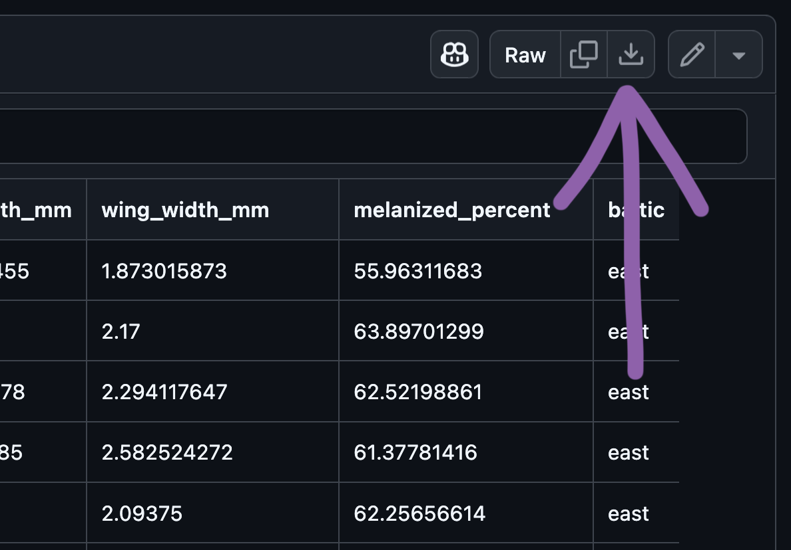
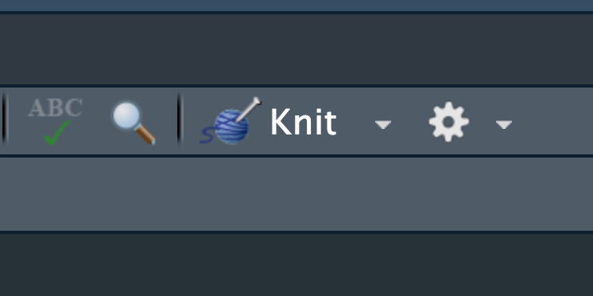

# Get RStudio setup

Each time we start a new exercise, you should:

1. Make a new folder in your course folder for the exercise (e.g. `biob11/exercise_3`)
2. Open RStudio
   - If you haven't closed RStudio since the last exercise, I recommend you do so and then re-open it. If it asks if you
     want to save your R Session data, choose no.
3. Set your working directory by going to *Session* -> *Set working directory* -> *Choose directory*, then navigate to
   the folder you just made for this exercise.
4. Create a new Rmarkdown document (*File* -> *New file* -> *R markdown..*). Give it a clear title.

We are now ready to start.

# Tephritis phenotype

## Study background

Today we will work with a dataset called `tephritis_phenotype.csv`. The dataset comes from a study conducted at Lund
University by @nilsson2022.


> The dataset describes morphological measurements of the dipteran *Tephritis conura*. This species has specialised to
> utilise two different host plants (`host_plant`), *Cirsium heterophyllum* and *C. oleraceum*, and thereby formed
> stable host races. Individuals of both host races were collected in both sympatry (where both *Cirsium heterophyllum*
> and *C. oleraceum* host plants co-occur) and allopatry (where only one *Cirsium* species occurs) (`patry`) from eight
> different populations in northern Europe (`region`) from both sides of the Baltic sea (`baltic`). Individuals were
> measured after having been hatched in a common lab environment. One female and one male (`sex`) from each bud was
> measured. The authors took magnified photographs of each individual, and of the wings of each individual.

> Measured traits included wing length (`wing_length_mm`), wing width (`wing_width_mm`), melanised percentage cover
> (`melanized_percent`), body length (`body_length_mm`) and ovipositor length (`ovipositor_length_mm`). Body length and
> wing measurements were collected by measuring images digitally. Wing melanisation was measured using an automated
> script, which quantified how many pixels of the wing was melanised.

::: {.callout-note icon="false"}
## ✅ Task

1. Download the dataset from
   [Github](https://github.com/irmoodie/teaching_datasets/blob/main/tephritis_phenotype/tephritis_phenotype.csv).

{width=50%}

2. Move the downloaded `tephritis_phenotype.csv` file to your *working directory* folder.

:::

## Load R packages

In this exercise, we will use the `tidyverse` package.

::: {.callout-note icon="false"}
## ✅ Task

1. Make a new level 1 heading at the start of the document titled "Packages".
2. Make a new code cell.
3. Use `library()` to load the R packages required. Your first code cell should always load the packages required duirng
   your analysis.

Make sure you run the code cell.

:::

::: {.callout-note icon="false" collapse="true"}
## ❓ Hint

```{r}
library(tidyverse)
```
:::

## Importing data

We will now load the `tephritis_phenotype.csv` data file that you downloaded earlier. A `.csv` file is a file that
stores information in a table-like format with **C**omma **S**eparated **V**alues. A typical `.csv` file will look
something like this:

```
species,height,n_flowers
persica,1.2,12
persica,1.5,18
banksiae,2.4,3
banksiae,1.7,8
```

`.csv` files are especially suited to storing data that can be used across a wide variety of programmes, as everything
is stored as plain text.

::: {.callout-note icon="false"}
## ✅ Task

1. Make a new level 1 heading with the title "Load data"
2. Make a new code cell.
3. Load the `tephritis_phenotype.csv` data file using the `read_csv()` function and assign it to an object named
   `tephritis_data`.

:::

::: {.callout-note icon="false" collapse="true"}
## ❓ Hint

```{r}
tephritis_data <- read_csv("tephritis_phenotype.csv") #<1>
```

1. Be sure to use quote marks around the file name, and that you are using `read_csv()`, instead of `read.csv()`
:::

This has loaded a copy of the data from `tephritis_phenotype.csv` into R. Notice that the object `tephritis_data` has
also appeared in the *Environment* panel.


## Exploring data

### Getting a general overview

::: {.callout-note icon="false"}
## ✅ Task

Click on the object `tephritis_data` in the *Environment* panel with your mouse.

:::

This will open the dataset using the RStudio function `View()` (which if you look in your console, you will see it has
just run). This allows you to view the dataset as a table, like you would in a spreadsheet software like Microsoft
Excel. Note however, there is no way to edit the data in this view. This is by design. Any editing of the data needs to
be done in the RMarkdown document with code. That way, you can keep a record of any edits you make, without touching the
original data file.

::: {.callout-note icon="false"}
## ✅ Task

Make a new level 1 heading with the title: "Data description". Then underneath, in your RMarkdown document, answer the
following questions:

1. How many rows of data are in the dataset?
2. What is the unit of observation in this data set? In other words, what does each row represent?
3. What type of variable is:
   - `region`
   - `host_plant`
   - `patry`
   - `sex`
   - `body_length_mm`
   - `ovipositor_length_mm`
   - `wing_length_mm`
   - `wing_width_mm`
   - `melanized_percent`
   - `baltic`  
4. Are there any `NA` values in the dataset? In which variable(s) and why might this be?

:::

### Finding mistakes

Datasets can often be messy. People make mistakes entering data all the time. You should check this dataset for
potential errors. For a reference, these flies are very small, less than 1 cm in size.

::: {.callout-note icon="false"}
## ✅ Task

1. Make a new level 1 heading with the title: "Data cleaning".
2. In a new code cell(s), use the following methods to find potential mistakes in your dataset:
   a) The `summary()` function, when applied to a dataframe, will calculate basic summary statistics.
   b) Adapt code from the first exercise to make histograms of variables. Extreme values that are not plausible are
      probably mistakes, and should be removed.
   c) You can also, as you did before, click on the object `tephritis_data` in your *Environment* panel, and click on
      each variable header to sort it in different ways.
3. In your document, underneath the code cell where you find the mistake, make a note of which variables you need to
   clean, and what sort of mistake you've found.

:::

### Filtering out mistakes

We will use the `filter()` function to remove rows that contain improbably values. `filter()` let's us write conditional
statements that only allow rows that meet those conditions to "filter" through. For example, we could use filter to
remove all rows where `wing_length_mm` is greater than our guess at what the maximum should be.

```{r}
clean_data <- #<1>
tephritis_data |> #<2>
  filter(wing_length_mm < _____) |> #<3>
  filter(______ ______ ______) #<4>
```

1. Assign the cleaned data to a new object, called `clean_data`.
2. We pipe `|>` the data into the `filter()` function
3. This will only let though rows that have a `wing_length_mm` less than `<` \_\_\_\_\_
4. You can add more `filter()` functions as you wish.

This is an example of a **data processing "pipeline"**. It is a list of step-by-step instructions that clearly document
what we did to get, in this case, a clean dataset.

::: {.callout-note icon="false"}
## ✅ Task

1. Use the `filter()` function to create a dataset free of mistakes.
2. Check that your filtering has worked by remaking your histograms using `clean_data`.
3. If there are still mistakes, then add more `filter()` lines to the pipeline.

:::

## Descriptive statistics

We will now calculate some of the descriptive statistics we covered in the lecture (beyond what is calculated by the
`summary()` function). Remember, we want to work with the cleaned dataset from now on (`clean_data`).

### Contingency tables

Recall that contingency tables show how often certain cases (combinations of categories) are found in a dataset. Here,
we will use the `count()` function to produce a contingency table. For example, to create a table showing the number of
rows from each `region`, we can write:

```{r}
clean_data |> #<1>
  count(region) #<2>
```

1. We pipe `|>` the data into the `count()` function.
2. Within the count function, we provide the names of the variables we want to group the data by when counting the rows.

::: {.callout-note icon="false"}
## ✅ Task

1. Make a new level 1 heading with the title: "Descriptive statistics".
2. In a new code cell below that, make a contingency table that shows the frequencies of flies in each region `region`
   that use each`host_plant`, separated by `sex`.

:::

::: {.callout-note icon="false" collapse="true"}
## ❓ Hint

```{r}
clean_data |> 
  count(region, ______, ______) #<1>
```

1. You can keep adding variable names to group by as arguments to the `count()` function.
:::

### Pivot tables

Pivot tables are summary tables that work with anything other than frequency of cases. We will now build sets of data
summarising pipelines to produce tables of summary statistics.

For example, if we want to create a table that shows the mean and standard deviation of `wing_length_mm` for flies from
each `region`, we can write:

```{r}
clean_data |> #<1>
  group_by(host_plant) |> #<2>
  summarise( #<3>
    mean_wing_length = mean(wing_length_mm), #<4>
    sd_wing_length = sd(wing_length_mm) #<5>
  ) #<6>
```

1. We pipe `|>` the data into the `group_by()` function.
2. All functions that come after `group_by()` will provide an output for each category of the grouping variables.
3. `summarise()` allows us to calculate summary statistics on the dataset, respecting the groups defined by `group_by()`
4. Inside `summarise()` we define what summary statistics we want to calculate, and what we want to call them in the
   output.
5. Note we are still inside the brackets of `summarise()`, so we separate each arguement with a comma `,`.
6. We close the brackets of `summarise()`.

::: {.callout-note icon="false"}
## ✅ Task

Each in a new code cell, make tables that answer the following questions.

What are the `sex` and `host_plant` specific means, medians and standard deviations of:

1. `body_length_mm`
3. `wing_length_mm`
4. `wing_width_mm`

For females of different `host_plants`, calculate means, medians and standard deviations of:

1. `ovipositor_length_mm`

:::

::: {.callout-note icon="false" collapse="true"}
## ❓ Hint

Some helpful functions might include:

- `mean()`: Computes the *arithmetic mean* of a numeric vector.
- `median()`: Computes the *median* of a numeric vector.
- `min()`: Returns the *minimum* value in a numeric vector.
- `max()`: Returns the *maximum* value in a numeric vector.
- `quantile()`: Computes the *quantiles* of a numeric vector.
  - 1st quartile: `quantile(x, prob = 0.25)`, where `x` is a numeric vector.
  - 3rd quartile: `quantile(x, prob = 0.75)`, where `x` is a numeric vector.
- `var()`: Computes the *variance* of a numeric vector.
- `sd()`: Computes the *standard deviation* of a numeric vector.
- `length()`: Count the number of bits of data in a vector.

If your output shows as `NA`, this is likely because your variable contains missing values. If that's expected and you
think removing them is justified, use insert `drop_na(_______)` into your pipeline, after the first line. For example,
to drop all rows where `wing_length_mm` == NA, we could write:

```{r}
clean_data |>
  drop_na(wing_length_mm) |>
  ...
```

You can also filter out whole categories before making your tables using `filter()`. For example, to only include flies
from Estonia, we could write:

```{r}
clean_data |>
  filter(region == "estonia") |>
  ...
```

:::

## Making plots

R has a built in method to make plots, but we will avoid it in this course. Instead we use `ggplot2`, a plotting package
that is installed with `tidyverse`. `ggplot2` is based in a data visualisation theory known as *the grammer of graphics*
(gg) [@wilkinsonGrammarGraphics2013].

### The grammer of graphics

The grammer of graphics gives us a way to describe any plot. `ggplot2` then allows us to make that plot, using a layered
approach to the grammer of graphics.

Using this approach, we can say a statistical graphic is a `mapping` of `data` variables to `aes`thetic attributes of
`geom`etric objects.

Wow. What does that mean? Let's break it down.

A `ggplot2` plot has three essential components:

- `data`: the dataset that contains the variables you want to plot
- `geom`: the geometric object you want to use to display your data (e.g. a point, a line, a bar).
- `aes`: aesthetic attributes that you want to map to your geometric object. For example, the x and y location of a
  point geometry could be mapped to two variables in your dataset, and the colour of those points could be mapped to a
  third.

For example, to look at the relationship between `body_length_mm` and `wing_length_mm` we can construct a `ggplot`
recipe as follows:

We start by specifiying the `data` we want to plot.

```{r}
clean_data |> #<1>
  ggplot() 
```

1. We could have also written `ggplot(data = clean_data)` or `ggplot(clean_data)`, but let's use pipes `|>` to keep
   things consistent.

Next we can specify our `aes`thetics. We do that by writing the `aes()` function inside the `ggplot()` function.

```{r}
clean_data |>
  ggplot(aes(x = body_length_mm, y = wing_length_mm)) #<1>
```

1. Anything we write inside the `aes()` function will map data to our plot.

And finally we add our `geom`etry, in this case a `geom_point()`.

```{r}
clean_data |>
  ggplot(aes(x = body_length_mm, y = wing_length_mm)) + #<1>
  geom_point()
```

1. Note that `ggplot2` uses `+` to add layers to a plot, not the `|>` operator.

::: {.callout-note icon="false"}
## ✅ Task

Make a new level 1 heading titled: "Figures". Underneath, make a new code cell for each of the following plots that
display the relationship between:

1. `body_length_mm` and `sex`
2. `ovipositor_length_mm` and `host_plant`
3. `wing_length_mm` and `wing_width_mm` and `sex`
4. The number of flies measured from each `region` and `host_plant`

For each plot, write a small figure caption below the code cell that describes the trend you see (if any) in the plot.

You should use the following `geom_`s at least once, but one plot can use multiple `geom_`s.

`geom_point()` `geom_jitter()` `geom_boxplot()` `geom_violin()` `geom_bar()`

To find out what they do, try using them, or search the helpfiles in the *Outputs* panel. You can also, for any
function, search for the helpfile by writing `?function_name`. E.g., if you wanted to know what `geom_jitter()` does,
you could run the command `?geom_jitter`, and the helpfile will open.

You can also consult the [`ggplot2`
"cheatsheet"](https://github.com/rstudio/cheatsheets/blob/main/data-visualization.pdf). The course books
[R4DS](https://r4ds.hadley.nz/data-visualize.html) and [MD2](https://moderndive.com/v2/viz.html) have good guides also.
:::

## Save your RMarkdown file!

Make sure you save your RMarkdown file regularly.

## Analysis

To finish today's exercise, you will use what you have learned to try and answer a research question. Any method or
approach you think is valid is fine here. We will cover on Friday how to formally approach these questions.

::: {.callout-note icon="false"}
## ✅ Task

Create a new level 1 heading titled: "Analysis". Below, you should answer one of the following research questions:

1. Do males have more dark patches on their wings than females?
2. Do females have different length ovipositors in the two host races?
3. Is the mean proportion of the female wing that is melanized greater than two-thirds?
4. Do male flies from the east of the Baltic sea differ in size to flies from the west of the Baltic sea?
5. Are female flies who live in sympatric populations bigger than female flies who live in allopatric populations?
6. Is the median wing width greater than 2.1 mm in male flies?

Use `filter()`, `group_by()`, `count()`, `summarise()`, `drop_na()` and `ggplot()` to create tables and figures that
address your research question. You should copy and adapt code that you wrote during this exercise. Make sure you keep
your document tidy and readable.

To decide which one you will work on, you are going to roll a virtual six sided die! Use this code to do it yourself:

```{r}
cat("You will work on question:", sample(c(1,2,3,4,5,6), 1)) #<1>
```

1. If you really dislike your chosen question, maybe you should roll again?

:::

# Knit your document

For your final task, you should "knit" your document into a HTML file. When you knit your document, RStudio:

1. Executes code chunks: all R code embedded in your document runs in sequence
2. Embeds results: output (tables, plots, numbers) is inserted into the document at the location of each code chunk 3,
   Processes markdown: markdown formatting (headers, bold, links, etc.) is converted to the output format (so it looks
   like the visual mode)
4. Generates output file: a single document is created with all code, results, and formatted text combined

This document is ideal for presenting to other people, as it contains all your notes, code and output, without the other
person needing to run your code.

::: {.callout-note icon="false"}
## ✅ Final task

Knit your document to a HTML file.



It will have been saved next to wherever your `.Rmd` file is saved.

Upload your `.html` file as your assignment for this exercise.

:::

::: {.callout-note icon="false" collapse="true"}
## ❓ Help it didn't work

If this fails, it most likely means your code is not in the correct order. Make sure any time you define an object, it
happens before you use it in some way. For example, this would fail:

```{r}
y + 2

y <- 10
```

Because `y` was not defined before it was used. I would need to rearrange the code to be:

```{r}
y <- 10

y + 2
```

RMarkdown documents are executed top to bottom, strictly. All the code required to make all the output must be present
in the document.

Otherwise, it could be you have a mistake in your code. The fail message should reference which line it was in. Try and
find it yourself before asking for help, but if you're really stuck then please just ask!

:::
