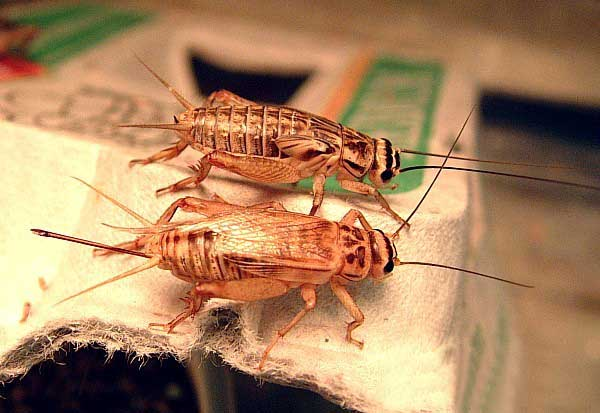

{fig-align="left"}

# Overview

In this assignment you will read the introduction and methods sections of a published research paper. However, the
results and discussion sections have been removed, as have most references to statistical methods used. For this
exercise to be useful, *please* do not look-up the original paper until you are finished.

The redacted version of the paper can be downloaded from
[Canvas](https://canvas.education.lu.se/courses/39432/assignments/291107).

The dataset the researchers collected can be downloaded from
[GitHub](https://github.com/irmoodie/teaching_datasets/blob/main/cricket_density/cricket_density.csv) or
[Canvas](https://canvas.education.lu.se/courses/39432/assignments/291107).

------------------------------------------------------------------------------------------------------------------------

Your task is to:

1. Identify the research questions and/or hypotheses of the study.
2. Design a set of statistical methods to address those hypotheses, given the data the authors collected, and write the
   missing *Statistical analysis* section of the methods section.
3. Carry out the statistical analysis, produce tables and figures, and write the missing *Results* section.

You should:

- Perform your analysis in a Rmd file.
- Write the missing *Statistical analysis* and *Results* in a word document (or something similar), using figures and
  results from the analysis.
- Submit both documents at the end of the [assignment](https://canvas.education.lu.se/courses/39432/assignments/291107).

------------------------------------------------------------------------------------------------------------------------

# Get RStudio setup

Each time you start a new exercise, you should:

1. Make a new folder in your course folder for the exercise (e.g. `biob11/exercise_8`)
2. Open RStudio
   - If you haven't closed RStudio since the last exercise, I recommend you close it and then re-open it. If it asks if
     you want to save your R Session data, choose no.
3. Set your working directory by going to *Session* -> *Set working directory* -> *Choose directory*, then navigate to
   the folder you just made for this exercise.
4. Make a new Rmd file (*File* -> *New file* -> *R markdown..*) and save it in the working directory folder. Delete any
   of the demo text not in the YAML frontmatter.
5. Download the dataset and move it into your working directory folder.
6. Load the `tidyverse` and `infer` packages.
7. Import the dataset using `read_csv()`.
8. Use Headings so that your document is clear and easy to follow.

------------------------------------------------------------------------------------------------------------------------

# Identify hypotheses

Read through the paper, and highlight any sentence that could form a hypothesis. For example on page 3:

> "we expected that males perceiving high-density environments would have larger testes and accessory glands (that
> produce seminal fluid) due to increased sperm competition."

This is a clear statement of a hypothesis about how perceived population density could have a directional effect on
testes and accessory gland size.

**Identify *at least* hypothesis from the paper in each of the following topics:**

- Metabolic rate
- Reproductive investment
- Aggressive behaviours
- Song characteristics

If while reading you develop your own own hypotheses, you can also add them.

------------------------------------------------------------------------------------------------------------------------

# Explore the dataset

The dataset contains 29 variables. You are not requried to use them all. A basic definition is given for each variable
below, but consulting the original paper is required to fully understand what each means, and to decide how to use it
properly. The dataset also contains many `NA` values, as not all crickets were used for all experiments. Be mindful of
this when working with it.

::: {.callout-note collapse="true" icon="false"}
## Variable definitions

##### Cricket variables

- `cricket_id`: identifier of the cricket
- `juvenile_environment`: either `high_density` or `low_density`

##### Respiration variables

- `resp_mass_g`: mass in grams of the cricket prior to the respiration measurements
- `resp_age_days`: age of the cricket in days prior to the respiration measurements
- `resp_volume_co2`: rate of $\text{CO}_2$ production (μL/min)
- `resp_volume_o2`: rate of $\text{O}_2$ consumption (μL/min)

##### Disection variables

- `dis_mass_g`: mass in grams of the cricket prior to the disection
- `dis_age_days`: age of the cricket in days prior to disection
- `dis_accessory_g`: mass in grams of the accessory glands
- `dis_testes_g`: mass in grams of the testes

##### Song variables

- `song_mass_g`: mass in grams of the cricket prior to the song measurements
- `song_age_days`: age of the cricket in days prior to song measurements
- `song_chirp_rate`: probably chirps per second
- `song_chirp_duration`: length of chirps (seconds)
- `song_pulses_per_chirp`: average number of pulses per chirp
- `song_pulse_duration`: average length of pulse duration
- `song_dominant_frequency`: song dominant frequency (kHz)

##### Aggresion variables

- `agg_mass_g`: mass in grams of the cricket prior to the aggresion trials
- `agg_age_days`: age of the cricket in days prior to the aggression trials
- `agg_trial_id`: identifier of the trial (shared between two crickets)
- `agg_winner`: was the cricket deemed to have won the aggression trial?
- `agg_dot_colour`: the colour dot that was used to identify the cricket in the trial
- `agg_female_present`: did the trial have a female present in the center of the arena?
- `agg_num_wins`: the number of battles the cricket won
- `agg_num_battles`: the total number of battles in the trial
- `agg_first_behaviour`: was the cricket the first in the trial to show an aggressive behaviour?
- `agg_first_song`: was the cricket the first in the trial to sing aggressively?
- `agg_first_song_length`: length of the first aggressive song the cricket sang.
- `agg_first_winner`: was the cricket the winner of the first aggressive encounter?

:::

------------------------------------------------------------------------------------------------------------------------

# Design the statistical analysis

Take each of your identified hypotheses and:

1. Decide which variables you can use to address it. What are your response and explanatory variables?
2. Decide on a sample/test statistic (mean, variance, standard deviation, difference in means, $F$, $\chi^2$,
   correlation, etc), method (regression) and/or approach (confidence intervals, hypothesis test) that would be best to
   address the hypothesis.

a. If using a hypothesis test, turn the hypothesis into a clear null and alternative hypothesis. Make sure to indicate
   the direction (lesser, greater, two-sided) if appropriate.

3. Write the *Statistical Analysis* section of the methods in your report (or do this later if you prefer).

::: {.callout-note collapse="true" icon="false"}
#### Guide on how to write about a statistical analysis

For each statistical approach, include the following in your text:

- **Objective**: Describe the rationale for the analysis and how it relates to the study objective.
- **Variables**: Define the experimental unit and the response and explanatory variables clearly.
- **Statistical method**: Describe the statistical method (e.g., ANOVA, difference in means, linear regression). How was
  the sampling / null distribution generated? What (if any) $\alpha$ value will you use (e.g., $\alpha$ = 0.05?). How
  will you calculate the confidence intervals / p-value?
- **Implementation**: Describe the function (e.g., `calculate()` from the `infer` package), package (e.g. `infer`), and
  software (e.g., R version 4.5.3) used and include any appropriate citations.
:::

::: {.callout-note collapse="true" icon="false"}
#### How to cite R correctly

To generate a citation for R itself, you can run:

```{r}
citation()
```

To get the name of the version of R you are running:

```{r}
R.version.string
```

To get the citation for any package you are using:

```{r}
citation("tidyverse")
```

```{r}
citation("infer")
```

:::

------------------------------------------------------------------------------------------------------------------------

# Perform the statistical analysis

Use what you have learned during the course so far to conduct the analysis you have described. Make use of the `infer`
package. Use examples from previous exercises, or from the [`infer` set of
examples](https://infer.tidymodels.org/articles/observed_stat_examples.html).

------------------------------------------------------------------------------------------------------------------------

# Write the results section

A results section is where you report your findings to all the hypotheses laid out in the introduction and methods. You
have already described your statistical analysis in the methods section, so there is no need to go into great detail
here. Importantly, in a paper with separate results and discussion sections, you should not discuss your findings in the
results section, only report them. Any time you report a result, you should back it up with a statistic, and a relevant
figure. A helpful two part structure you can follow for each result is the following:

1. Report the overall result in plain language. If the reader reads only this sentence, they should get the whole
   picture in broad terms.

> Perceived population density during development had X effect on reproductive investment.

2. Report the result in more specific terms. Make reference to the source of your results, such as statistical tests,
   tables and figures. You may have several sentences like this for each overall result.

> Accessory gland mass [did/did not] differ significantly between males reared in high or low densities (difference in means test, diff = X, $p = Y, figure Z).

::: {.callout-note collapse="true" icon="false"}
#### How to export figures from RStudio

Use the `ggsave()` function from `ggplot2` to save plots to disk. This function automatically detects the file format
from the file extension and adjusts quality settings appropriately.

**Basic usage:**

```r
# Save the last plot created
ggsave("figure_name.png")

# Save a specific plot object
ggsave("figure_name.png", plot = my_plot)
```

**Common parameters:**

- `filename`: the name and path of the file to save
- `plot`: the plot object to save (defaults to the last plot created)
- `width` and `height`: dimensions in inches (default: 7 x 7)
- `dpi`: resolution in dots per inch (default: 300 for raster formats)
- `device`: file format (e.g., "png", "pdf", "jpg"). Usually detected automatically from filename extension

**Practical example:**

```r
# Save as PNG with custom dimensions
ggsave("results/density_effect.png", plot = p1, width = 8, height = 6, dpi = 300)

```

**Tips:**

- Create a `results/` or `figures/` folder in your working directory to keep outputs organized
- Use descriptive filenames that relate to your hypotheses
- PNG works well for reports
- Higher `dpi` values (300+) are recommended for print publication

:::

------------------------------------------------------------------------------------------------------------------------

# Give the paper a title

Can you think of a good title for the paper? Often the title of a paper will summarise the results in a single line,
and/or try to be eye catching.

------------------------------------------------------------------------------------------------------------------------

# Submit your work

Submit your work (both a knitted HTML analysis, and a document with the text and key figures) via the [Canvas
assignment](https://canvas.education.lu.se/courses/39432/assignments/291107).
