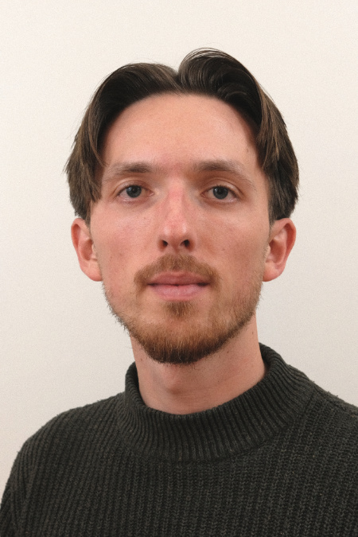
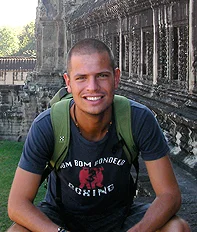
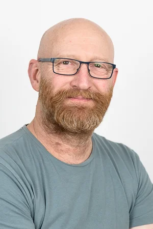

# Welcome to the course! {background-color="#015b58"}

## Försöksdesign och analys för biologer (BIOB11)
### Course rational

- Biology is full of interesting research questions
- Nearly all research in biology relies on collecting and analysing data of some kind
- Experimental design and statistical literacy is therefore important for:
  - ***doing*** your own research
  - ***understanding*** and ***evaluating*** research of other scientists

## Försöksdesign och analys för biologer (BIOB11)
### After completion of the course you should be able to:

- Explain fundamental concepts in experimental design and statistics
- Design and evaluate studies in relation to a research question
- Handle and manipulate biological data using R
- Statistically analyse, interpret and draw conclusions from biological data
- Present statistical results graphically, in writing and orally

## Försöksdesign och analys för biologer (BIOB11)
### How we are going to achieve those aims:

- Series of lectures/discussions (not passive)
- Series of computer exercises
- Literature seminar
- Creating a portfolio of analyses you can draw from
- Use modern techniques

## Försöksdesign och analys för biologer (BIOB11)
### What we expect from you

- Attend as much as you can (note some parts are mandatory to attend)
- Be friendly and open with each other, and work together
- Use assignments as on opportunity to learn
  - Read and reflect on feedback (instructor and peer)
- Tell us when something is unclear

# Who are we? {background-color="#015b58"}

## Iain Moodie
### Lectures, exercises and project work

:::: columns
::: {.column width="60%"}
-   Doctoral student in the _Biodiversity & Evolution_ division
-   Research integrates evolutionary biology into ecotoxicology
-   Course leader
:::

::: {.column width="40%"}
{fig-alt="Headshot of Iain Moodie" fig-align="center" width="325"}
:::

::::

## Kaj Hulthén
### Lecture: scientific integrity and ethics

:::: columns
::: {.column width="60%"}
-   Researcher in the *Functional Ecology* division
-   Researches migration in aquatic ecosystems
:::

::: {.column width="40%"}
{fig-alt="Headshot of Kaj Hulthén" fig-align="center" width="375"}
:::

::::

## Anders Nilsson
### Ladok teacher

:::: columns
::: {.column width="60%"}
-   Professor & Head of *Functional Ecology* division 
-   Aquatic ecologist
-   Handles grades in Ladok
:::

::: {.column width="40%"}
{fig-alt="Headshot of Anders Nilsson" fig-align="center" width="325"}
:::

::::

# Course structure {background-color="#015b58"}

## Course structure
### Where to find information

- [LU Canvas](https://canvas.education.lu.se/courses/39432)
  - Announcements
  - Schedule
  - Links to materials
  - Discussion

- [Course website](https://irmoodie.com/biob11/) (Iain's materials)
  - Will always be linked from Canvas

## Course structure
### Schedule

<iframe width="1000" height="570" src="https://irmoodie.com/biob11/"></iframe>

## Course structure
### Literature

- [**Introduction to Modern Statistics, 2nd ed,. Çetinkaya-Rundel & Hardin (2024)**](https://openintro-ims.netlify.app/) (IMS2)
- [Statistical Inference via Data Science 2nd ed., Ismay, Kim & Valdivia (2025)](https://moderndive.com/v2/) (MD2)
- [R for Data Science, 2nd ed., Wickham, Çetinkaya-Rundel & Grolemund (2023)](https://r4ds.hadley.nz/) (R4DS)
- [Hands-On Programming with R, Grolemund (2018)](https://rstudio-education.github.io/hopr/) (HOPR)
- [Fundamental statistical concepts and techniques in the biological and environmental sciences, 1st ed. Duthie (2025)](https://bradduthie.github.io/stats/) (StatBio)

## Course structure
### How to contact us

- Ask during the exercise sessions or at the end of lectures.
- Email: [iain.moodie@biol.lu.se](mailto:iain.moodie@biol.lu.se)
- Email: [kaj.hulthen@biol.lu.se](mailto:kaj.hulthen@biol.lu.se)
- [LU Canvas](https://canvas.education.lu.se/courses/39432)

# Questions? {background-color="#015b58"}