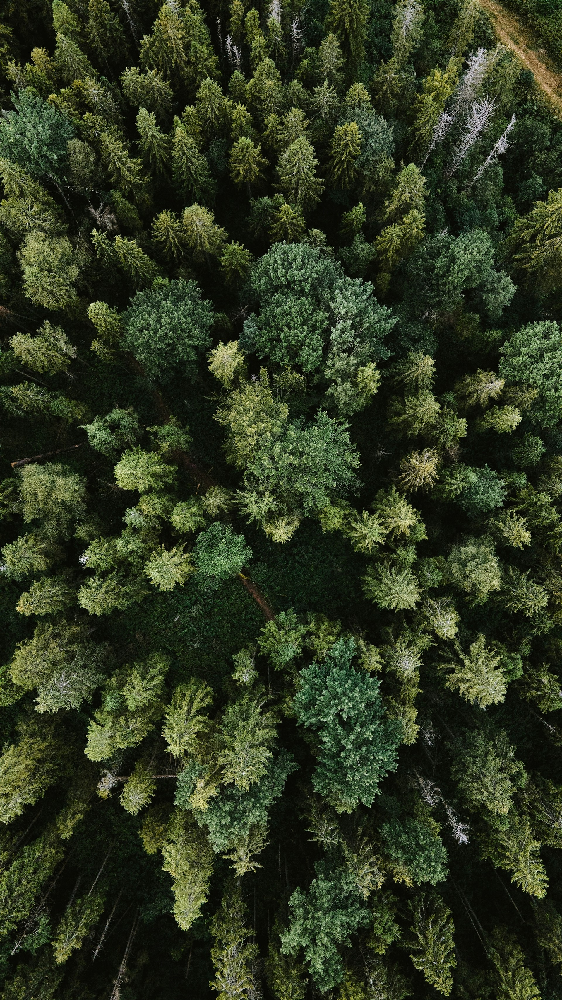
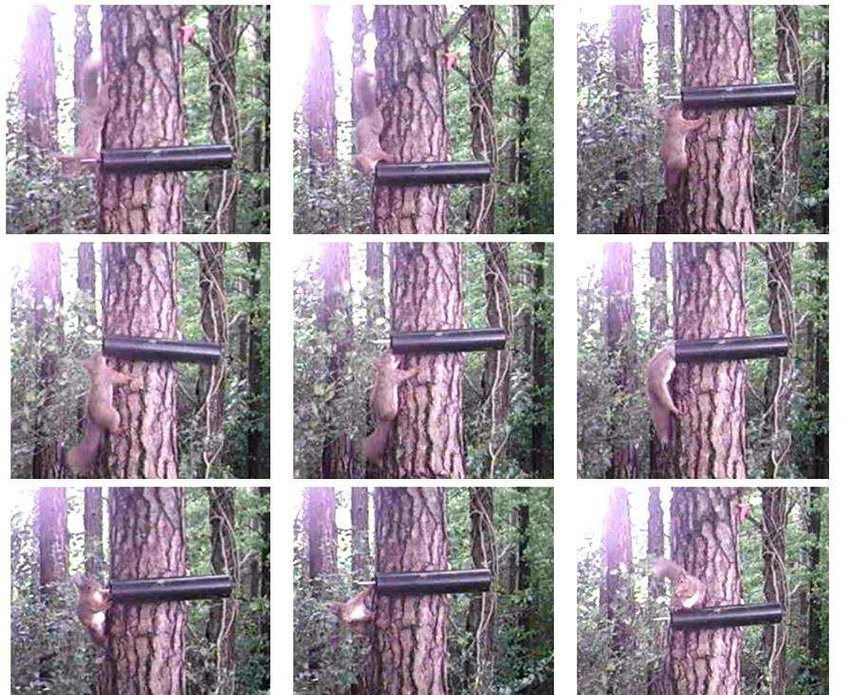
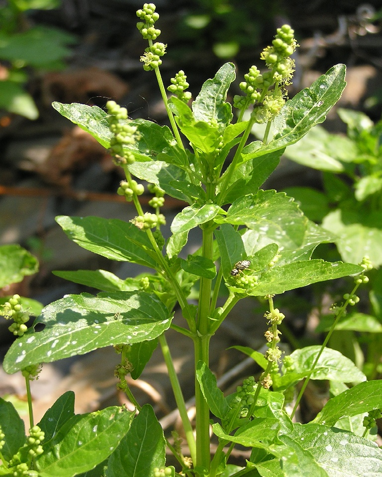
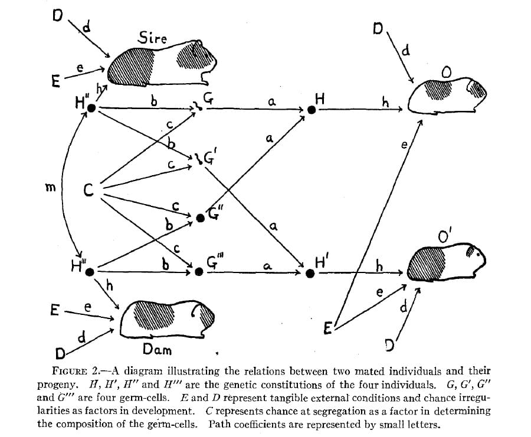
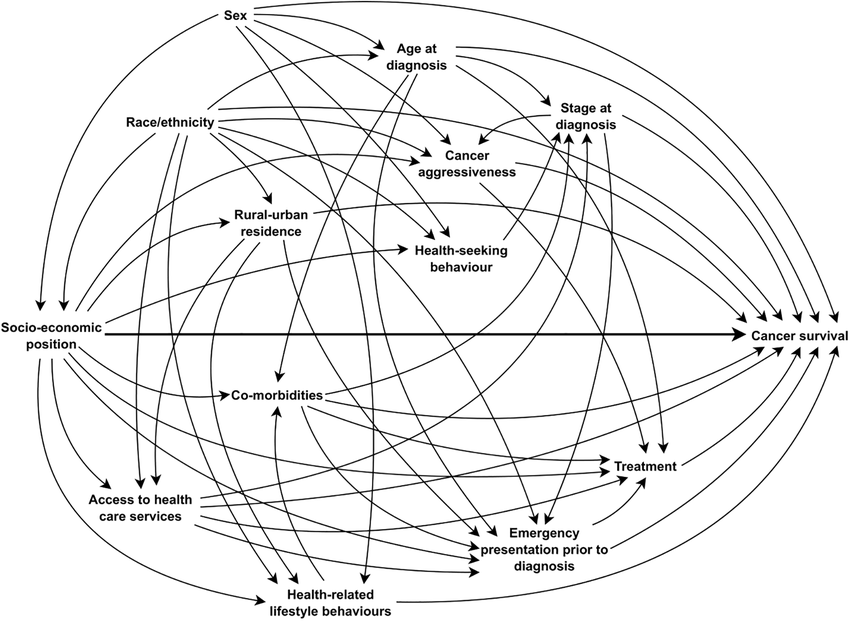

# Populations and samples {background-color="#8e61aa"}

```{r}
#| echo: false
#| eval: true
library(tidyverse)

theme_set(
  theme_bw(base_size = 20, base_family = "Atkinson Hyperlegible") +
    theme(aspect.ratio = 1)
)
```

## Populations and samples
### Why we collect data

::: columns
::::: {.column width="60%"}
- Recording some kind of observation or measurement
- Example:
  - Measuring the heights of different trees in a forest
  - Measuring the carbon in the forest soil at different locations
- We want to say something about the forest in general
:::::

::::: {.column width="40%"}
{fig-alt="A drone shot of a forest" fig-align="center" width="300"}
:::::

:::

::: {.attribution}
Photo by [Olena Bohovyk](https://unsplash.com/@olenkasergienko)
:::

## Populations and samples
### Why we collect data

::: columns
::::: {.column width="60%"}
- Cannot measure every tree or soil at every location
- Instead, we collect a [**sample**]{style="color: #8e61aa;"} of data
- Use the sample to draw conclusions about the [**population**]{style="color: #8e61aa;"}
- Statistics allows us to approximate properties of entire populations from a limited number of
  samples^[If conducted correctly, and still even then, with caution]

:::::

::::: {.column width="40%"}
{fig-alt="A drone shot of a forest" fig-align="center" width="300"}
:::::

:::

::: {.attribution}
Photo by [Olena Bohovyk](https://unsplash.com/@olenkasergienko)
:::

## Populations and samples
### Definitions

::: {.callout-important}
## Population

The totality of individual observations about which inferences are to be made, existing anywhere in the world or at
least within a definitely specified sampling area limited in space and time.
:::

::: {.callout-important}
## Sample

A collection of individual observations selected by a specified procedure.
:::

## Populations and samples
### Examples

::: columns
::::: {.column width="50%"}
**Populations**

- All the spruce (gran) trees in Skåne
- All the blue tits (blåmes) in Sweden
- All the genes in the common fruit fly (*Drosophila melanogaster*)
- All the herring (sill) in the Baltic sea

:::::

::::: {.column width="50%"}
**Samples**

- 300 spruce trees from forests in Skåne
- 100 caught blue tits from nest boxes in Sweden
- 20 genes from the *Drosophila melanogaster* genome
- 1000 herring caught by a fishing boat off the coast of Karlskrona

:::::

:::

## Populations and samples
### Parameters and statistics

- Many statistical analyses are focused on a numerical summary.
  - E.g. Mean, standard deviation, correlation
- Can be exactly calculated (measurement error aside) from the population: **population parameter**
- Can be inferred from a representative sample: **sample statistic**
- If the data was collected representatively, then a sample statistic should be a good approximation of population
  parameter.

## Populations and samples
### Anecdotal evidence

> "I saw a bumblebee in Skrylle that was huge! Therefore bumblebees in Skrylle must be unusually large."

## Populations and samples
### Anecdotal evidence

> "I saw a bumblebee in Skrylle that was huge! Therefore bumblebees in Skrylle must be unusually large."

- Few data points
- Data collected haphazardly
- Rare cases are more memorable than common ones

## Populations and samples
### How to sample from a population

::: {.columns}
::::: {.column}
How could we collect a representative sample of:

- Students currently studying at the Department of Biology?
- Students across the whole university?
:::::
::::: {.column}

:::::
:::

::: {.attribution}
Photo by Alexandra Roslund
:::



## Populations and samples
### How to sample from a population

::: {.columns}
::::: {.column}
How could we collect a representative sample of:

- DNA from red squirrels in Skåne?
:::::
::::: {.column}

:::::
:::



## Populations and samples
### How to sample from a population

- If we want to claim that our **sample statistic** is a good representation of the **population parameter**:
  - Sample is unbiased
  - Randomness is a good way to achieve that
    - But sometimes simple random sampling is not appropriate

## Populations and samples
### If you know the population parameter, no need for statistics

{fig-align="center"}

# Experimental design {background-color="#8e61aa"}

## Experimental design
### Observational vs experimental studies

::: {.columns}
::::: {.column}
What are the main difference between these two studies?

1. I measure the biomass of wild *Mercurialis annua* plants found in sandy soils and in loamy soils in a nature reserve.
2. I grow *Mercurialis annua* plants in either sandy or loamy soils from seeds, and measure there biomass after a 3
   months.
:::::
::::: {.column}
{fig-align="center" width="380"}
:::::
:::

::: {.attribution}
Photo by Michael Becker
:::



## Experimental design
### Principles of experimental design

Experiment:

- When we assign treatments
- When we make an intervention
- When we manipulate something
- No longer just observing

## Experimental design
### Principles of experimental design: **controlling**

::: {.columns}
::::: {.column}
Try to control for differences that *we can control* but are not interested in.

For example:

- Water all plants the same amount
- Keep the temperature in the greenhouse the same
- Space out the plants evenly

:::::
::::: {.column}
{fig-align="center" width="380"}
:::::
:::

::: {.attribution}
Photo by Michael Becker
:::

## Experimental design
### Principles of experimental design: **randomisation**

::: {.columns}
::::: {.column}
Try to account for differences that *we cannot control* and are not interested in.

For example:

- Randomly assign seeds to soil type (treatment)
- Randomly assign pots to rooms in a greenhouse

:::::
::::: {.column}
{fig-align="center" width="380"}
:::::
:::

::: {.attribution}
Photo by Michael Becker
:::

## Experimental design
### Principles of experimental design: **replication**

Which statement gives you more confidence? Why?

> "A clinical trial of a new blood pressure medication reduced the number of heart attacks in the treatment group by 96%
> and no negative side effects were reported (sample size = 14 people)"

> "A clinical trial of a new blood pressure medication reduced the number of heart attacks in the treatment group by
> 82%, and 2% of participants reported negative side effects (sample size = 300 people)"



## Experimental design
### Principles of experimental design: **replication**

- The larger the sample size, the more accurately we can assess the effect of our treatment (explanatory variable) on
  the response variable.
- Each replicate should be **independent** of all others
  - Otherwise we risk **pseudoreplication**

## Experimental design
### Principles of experimental design: **replication**

::: {.columns}
::::: {.column}
**Pseudoreplication**

- 50 plants in each treatment
- I measure 10 leaves from each plant
- Is my sample size per treatment:
  - n = 50
  - n = 500

:::::
::::: {.column}
{fig-align="center" width="380"}
:::::
:::

::: {.attribution}
Photo by Michael Becker
:::



## Experimental design
### Principles of experimental design: **blocking**

When we suspect variables other than the treatment influence the treatment. Sometimes done for logistical reasons.

Examples:

- **Temporal blocks:** split into experimental groups that are conducted at different times
- **Spatial blocks:** split into experimental groups that are conducted in different locations
- **"Risk" blocks:** split into experimental groups that you expect to react differently to the treatment

## Experimental design
### Common types of experimental design: **factorial design**

Experiments where multiple treatments are applied, and all combinations of treatments are used:

| Soil type | Fertiliser |
| --------- | ---------- |
| Sandy     | None       |
| Sandy     | Added      |
| Loamy     | None       |
| Loamy     | Added      |

# Causation {background-color="#8e61aa"}

## Causation
### Observational vs experimental studies

::: {.columns}
::::: {.column}
What are the main difference between these two studies?

1. I measure the biomass of wild *Mercurialis annua* plants found in sandy soils and in loamy soils in a nature reserve.
2. I grow *Mercurialis annua* plants in either sandy or loamy soils from seeds, and measure there biomass after a 3
   months.
:::::
::::: {.column}
{fig-align="center" width="380"}
:::::
:::

::: {.attribution}
Photo by Michael Becker
:::

## Causation
### Causal pathways

::: {.columns}
::::: {.column}
:::::
::::: {.column}
```{mermaid}
 graph TD;
      A(Soil type) --> B(Plant biomass);
```
:::::
:::

## Causation
### Confounding variables

::: {.columns}
::::: {.column}
- Anything that confuses you about the causation
  - Can be ommitted variables
:::::
::::: {.column}
```{mermaid}
 graph TD;
      A(Soil type) --> B(Plant biomass);
      U(((u))) --> B;
```
:::::
:::

## Causation
### Confounding variables

::: {.columns}
::::: {.column}
- Anything that confuses you about the causation
  - Can be ommitted variables
  - Can also be measured
:::::
::::: {.column}
```{mermaid}
 graph TD;
      A(Soil type) --> B(Plant biomass);
      U(Plant density) --> B;
```
:::::
:::

## Causation
### Causal reasoning via DAGs

::: {.columns}
::::: {.column}
- Directed acyclic graphs
- Causation flows along the arrows
  - A causes Y
  - B also causes Y
- Used to define causal relationships to then:
  - Design experiments
  - Design statistical methods
:::::
::::: {.column}
```{mermaid}
 graph TD;
      A(A) --> Y(Y);
      B(B) --> Y(Y);
```
:::::
:::

## Causation
### Causal reasoning via DAGs

{fig-align="center"}

## Causation
### Causal reasoning via DAGs

{fig-align="center"}

## Causation
### Causal reasoning via DAGs



## Causation
### Causal reasoning via DAGs: **forks**

::: {.columns}
::::: {.column}
- X and Y are associated (not independent)
- Z is a "common cause"
- Once grouped by Z, no association between X and Y
:::::
::::: {.column}
```{mermaid}
 graph TD;
      Z(Z) --> Y(Y);
      Z --> X(X);
```
:::::
:::

## Causation
### Causal reasoning via DAGs: **forks**

::: {.columns}
::::: {.column}
- X and Y are associated (not independent)
- Z is a "common cause"
- Once grouped by Z, no association between X and Y
:::::
::::: {.column}
```{r}
#| fig-align: center

set.seed(11)
N <- 300
Z <- rbinom(N, 1, 0.5)
X <- rnorm(N, 2 * Z - 1)
Y <- rnorm(N, 2 * Z - 1)

df <- tibble(X = X, Y = Y, Z = factor(Z))

ggplot(df, aes(x = X, y = Y, color = Z)) +
  geom_point(size = 2, alpha = 0.5) +
  geom_smooth(method = "lm", se = FALSE, formula = y ~ x) +
  geom_smooth(aes(color = NULL), method = "lm", se = FALSE, formula = y ~ x, color = "black", linetype = "solid", linewidth = 1.2)


```
:::::
:::

## Causation
### Causal reasoning via DAGs: **pipes**

::: {.columns}
::::: {.column}
- X and Y are associated (not independent)
- The effect of X on Y is transmitted through Z
- Once grouped by Z, no association between X and Y
:::::
::::: {.column}
```{mermaid}
 graph LR;
      Z(Z) --> Y(Y);
      X(X) --> Z;
```
:::::
:::

## Causation
### Causal reasoning via DAGs: **pipes**

::: {.columns}
::::: {.column}
- X and Y are associated (not independent)
- The effect of X on Y is transmitted through Z
- Once grouped by Z, no association between X and Y
:::::
::::: {.column}
```{r}
#| fig-align: center

set.seed(11)
N <- 300
X <- rnorm(N)
Z <- Rlab::rbern(N,rethinking::inv_logit(X))
Y <- rnorm(N,(2*Z-1))

df <- tibble(X = X, Y = Y, Z = factor(Z))

ggplot(df, aes(x = X, y = Y, color = Z)) +
  geom_point(size = 2, alpha = 0.5) +
  geom_smooth(method = "lm", se = FALSE, formula = y ~ x) +
  geom_smooth(aes(color = NULL), method = "lm", se = FALSE, formula = y ~ x, color = "black", linetype = "solid", linewidth = 1.2)


```
:::::
:::

## Causation
### Causal reasoning via DAGs: **colliders**

::: {.columns}
::::: {.column}
- X and Y are not associated (independent)
- X and Y both influence Z
- Once grouped by Z, X and Y are associated
:::::
::::: {.column}
```{mermaid}
 graph LR;
      Y(Y) --> Z(Z);
      X(X) --> Z;
```
:::::
:::

## Causation
### Causal reasoning via DAGs: **colliders**

::: {.columns}
::::: {.column}
- X and Y are not associated (independent)
- X and Y both influence Z
- Once grouped by Z, X and Y are associated
:::::
::::: {.column}
```{r}
#| fig-align: center

set.seed(11)

N <- 300
X <- rnorm(N)
Y <- rnorm(N)
Z <- Rlab::rbern(N,rethinking::inv_logit(2*X+2*Y-2))

df <- tibble(X = X, Y = Y, Z = factor(Z))

ggplot(df, aes(x = X, y = Y, color = Z)) +
  geom_point(size = 2, alpha = 0.5) +
  geom_smooth(method = "lm", se = FALSE, formula = y ~ x) +
  geom_smooth(aes(color = NULL), method = "lm", se = FALSE, formula = y ~ x, color = "black", linetype = "solid", linewidth = 1.2)


```
:::::
:::

## Causation
### Causal reasoning via DAGs: **descendants**

::: {.columns}
::::: {.column}
- X and Y are causally associated via Z
- A contains information about Z
- Once grouped by A, X and Y are *less* associated
- A is a proxy for Z
:::::
::::: {.column}
```{mermaid}
 graph LR;
      Z(Z) --> Y(Y);
      X(X) --> Z;
      Z --> A(A);
```
:::::
:::

# The scientific method {background-color="#8e61aa"}

## The scientific method
### Why do we do science?

- Why do you do science?
- Why should we (as a society) do science?
- Who do we do science for (if anyone)?

::: {.content-visible when-format="revealjs"}

:::

## The scientific method
### How do we do science?

- Why do we study what we study?
  - Who decides?
- How do we find agreement?
  - How do we handle disagreement?
- How do we go from unknowns to knowns?
- How does a scientific field progress?

::: {.content-visible when-format="revealjs"}

:::

<!-- ## The scientific method
### The process of inquiry

::: {.incremental}
1. Make observations
2. Formulate a hypothesis (construct a causal model)
3. Design experiment (from your causal model)
4. Conduct the experiment (obtain data)
5. Analyze the data
6. Formulate conclusion
7. Synthesize results with other studies, and determine next steps
::: -->
