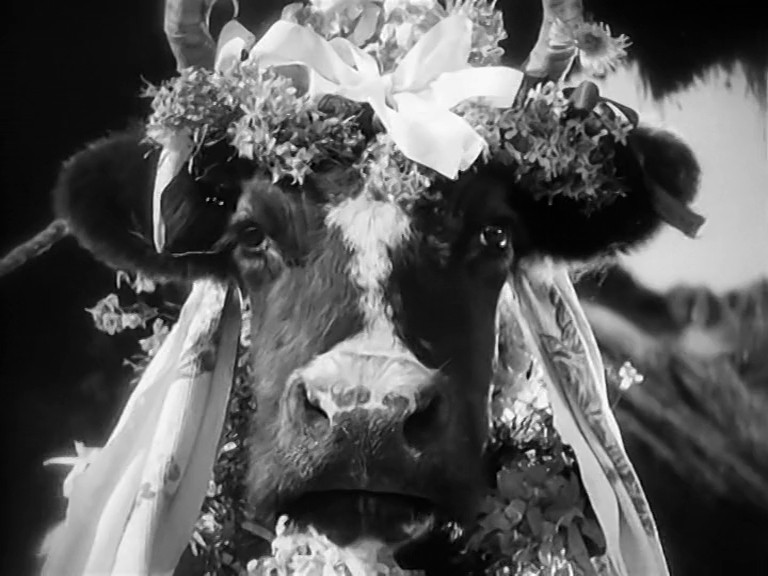



# Sampling distributions

```{r}
#| eval: true
#| echo: false
library(tidyverse)
library(palmerpenguins)
theme_set(theme_bw(base_size = 16) + theme(aspect.ratio = 1))
```

```{webr}
#| edit: false
#| echo: false
#| output: false
library(tidyverse)
library(infer)
library(palmerpenguins)

theme_set(theme_bw(base_size = 16) + theme(aspect.ratio = 1))

rate <- 0.21
N = 500

cow_population <-
  tibble(status = rep(c("diseased", "healthy"), times = c(rate*N, (1-rate)*N))) |>
  sample_n(N, replace = FALSE)
```

## Sampling distributions
### Dairy disease

::: {.columns}
::::: {.column}
A large dairy farm ($N$=500) has a potential outbreak of a disease. Testing for the disease is costly, so only a sample
($n$=50) cows are tested to estimate the population's prevalence of the disease.
:::::
::::: {.column}
{fig-alt="A cow" fig-align="center" width="500"}
:::::
:::

::: {.attribution}
Photo from [The General Line (1929)](https://en.wikipedia.org/wiki/The_General_Line)
:::

## Sampling distributions
### Dairy disease: **collect a sample**

```{webr}
cow_sample <-
  cow_population |> 
  slice_sample(n = 50)
```

```{webr}
cow_sample
```

## Sampling distributions
### Dairy disease: **observe your sample statistic**

Calculate the proportion of cows that are diseased in the sample:

```{webr}
obs_stat <-
  cow_sample |>
  specify(response = status, success = "diseased") |>
  calculate(stat = "prop")

obs_stat
```

## Sampling distributions
### Dairy disease: **report your observed statistics**

TODO: Whiteboard picture

## Sampling distributions
### What is a sampling distribution?

- The distribution of observed statistics (e.g. proportion) obtained through repeatedly **sampling** the population
- Shows the range of statistics we can **observe** through sampling
- Its central tendency gives us an idea about where the true **population** parameter value is
- Foundation of **confidence intervals** (today) and **hypothesis testing** (Monday)

## Sampling distributions
### What is a sampling distribution?

{fig-align="center" fig-align="middle"}

## Sampling distributions
### A problem...

- We (usually) collect **a single sample!**
- A sampling distribution by definition requires many samples.

# Bootstrap resampling {background-color="#61599d"}

## Bootstrap resampling
### How to construct a sampling distribution from a single sample

```{webr}
cow_sample
```

## Bootstrap resampling
### How to construct a sampling distribution from a single sample

- If we assume that the sample is representative of the population
  - collected randomly and without bias (yesterday's lecture)
- We can **re-sample** the sample *with replacement* to create more "samples"
  - Process known as the **bootstrap** (samples are called "bootstrap samples")
  - From English phrase: "To pull one's self up by their own bootstraps"
  - Seems impossible?

## Bootstrap resampling
### Re-sample your sample (with replacement)

```{webr}
cow_sample |>
  specify(response = status, success = "diseased") |>
  generate(reps = 10, type = "bootstrap")
```

## Bootstrap resampling
### In each bootstrap sample, calculate the statistic

```{webr}
cow_bootstrap_dist <-
  cow_sample |>
  specify(response = status, success = "diseased") |>
  generate(reps = 10000, type = "bootstrap") |>
  calculate(stat = "prop")

cow_bootstrap_dist
```

## Bootstrap resampling
### Make a bootstrap sampling distribution

- Proportions from 10000 bootstrap samples

```{webr}
cow_bootstrap_dist |>
  ggplot(aes(x = stat)) +
  geom_histogram(bins = 12, colour = "white")
```

## Bootstrap resampling
### Make a bootstrap sampling distribution

- Proportions from 10000 bootstrap samples

```{webr}
cow_bootstrap_dist |>
  visualise()
```

## Bootstrap resampling
### Compare to your observed statistic

- Proportions from 10000 bootstrap samples
- Observed proportion (proportion of original sample) in red
- The observed mean is still our best guess at the true mean
- Bootstrap sampling distribution allows us to quantify our uncertainty in the mean

```{webr}
cow_bootstrap_dist |>
  visualise() +
  geom_vline(data = obs_stat, aes(xintercept = stat), colour = "red")
```

## Bootstrap resampling

{fig-align="center" fig-align="middle"}

## Bootstrap resampling
### Extremely flexible

- Works for almost any statistic!
  - Can be applied to new statistics / unique questions where a dedicated test procedure doesn't exist
- Makes no distributional assumptions

# Quantifying sampling error {background-color="#61599d"}

If we collected another sample of the same size, how much would our test statistic be likely to vary?

## Quantifying sampling error
### What range of observed statistics is plausible?

- If we took another sample, it is unlikely that we would get exactly the same observed statistics
- How confident are we in our sample statistic?
- We want to quantify this (**sampling error**)
- Problem: we (usually) only ever collect one sample
- Solution: generate more samples using **bootstrap resampling**

## Quantifying sampling error
### The standard error (SE)

- The **standard error** is the **standard deviation** of the **sampling distribution**
- Use the bootstrap generated sampling distribution as our sampling distribution
- Assumptions: your sampling distribution is approximately normally distributed (bell-curve)
- If calculated with a bootstrap sampling distribution often written as $SE_{boot}$

## Quantifying sampling error
### The standard error (SE)

```{webr}
cow_bootstrap_dist |>
  summarise(
    se = sd(stat)  
  )
```

## Quantifying sampling error
### The confidence interval

- "Sloppy" definition: the range where we expect the true population parameter to be
- Real definition: If we repeated our experiment many times and calculated a X% CI each time, the X% CI’s would include
  the “true” population value X% of the time

## Quantifying sampling error
### The confidence interval

- For historical reasons in most of biology, we tend to use 95% confidence intervals
  - Nothing special about that number

Many methods to calculate:

- **Percentile method**: Middle X% of the sampling distribution
- No assumptions, but requires a large (>30 >>14) sample size to be accurate

## Quantifying sampling error
### The confidence interval: **percentile method**

```{webr}
conf_int <-
  cow_bootstrap_dist |>
  get_confidence_interval(level = 0.95, type = "percentile")

conf_int
```

```{webr}
cow_bootstrap_dist |>
  visualise() +
  shade_confidence_interval(conf_int)
```

## Quantifying sampling error
### The confidence interval: **testing the definition**

- If we repeated our experiment many times and calculated a 95% CI each time, the 95% CI’s would include the “true”
  population value X% of the time
- Draw your confidence interval on the whiteboard
- TODO: Whiteboard picture

## Quantifying sampling error
### Confidence interval using a bootstrap sampling distribution

{fig-align="center"}

## Quantifying sampling error
### Reporting confidence intervals

Common method:

- Observed statistic (X% CI: lower_ci - upper_ci)
- 84% (99% CI: 70% - 90%)
- 84% (99% $CI_{boot}$: 70% - 90%)

## Quantifying sampling error
### An example

*"Breakthrough Drug Reduces COVID-19 Hospitalizations by 12%!"*

- A new antiviral drug reduced COVID-19 hospitalizations by 12% in a clinical trial involving 1,000 patients.
- A new antiviral drug reduced COVID-19 hospitalizations by 12% (95% CI: -11 to 32%) in a clinical trial involving 1,000
  patients.



## Quantifying sampling error
### Confidence interval for differences between two independent groups

::: {.columns}
::::: {.column}
- What is the difference in average size of males and females?
- Statistic?
:::::
::::: {.column}
```{r}
penguins |>
    filter(species == "Chinstrap") |>
    drop_na(sex) |>
    ggplot(aes(x = sex, y = body_mass_g)) +
    geom_jitter(alpha = 0.2) +
    geom_boxplot(outliers = FALSE) +
    labs(title = "Body mass of Chinstrap penguins")

```
:::::
:::

## Quantifying sampling error
### Confidence interval for differences between two independent groups

```{webr}
chinstrap_data <- 
  penguins |>
  filter(species == "Chinstrap") |>
  drop_na(sex)
```

## Quantifying sampling error
### Confidence interval using a bootstrap sampling distribution

{fig-align="center"}

## Quantifying sampling error
### Confidence interval for differences between two independent groups

```{webr}
chinstrap_obs <-
  chinstrap_data |>
  specify(response = body_mass_g, explanatory = sex) |>
  calculate(stat = "diff in means", order = c("male", "female"))

chinstrap_obs
```

## Quantifying sampling error
### Confidence interval using a bootstrap sampling distribution

{fig-align="center"}

## Quantifying sampling error
### Confidence interval for differences between two independent groups

```{webr}
chinstrap_bootstrap_dist <-
  chinstrap_data |>
  specify(response = body_mass_g, explanatory = sex) |>
  generate(reps = 10000, type = "bootstrap") |>
  calculate(stat = "diff in means", order = c("male", "female"))

chinstrap_bootstrap_dist |>
  visualise()
```



## Quantifying sampling error
### Confidence interval using a bootstrap sampling distribution

{fig-align="center"}

## Quantifying sampling error
### Confidence interval for differences between two independent groups

```{webr}
chinstrap_conf_int <-
  chinstrap_bootstrap_dist |>
  get_confidence_interval(level = 0.95, type = "percentile")

chinstrap_bootstrap_dist |>
  visualise() +
  shade_confidence_interval(chinstrap_conf_int) +
  geom_vline(xintercept = 0)
```

## Quantifying sampling error
### Key ideas

- The distribution of observed statistics obtained through repeatedly sampling the population is called the **sampling
  distribution**
- Since we often only take one sample, we can generate a sampling distribution using data from our sample via resampling
  our sample *with replacement* (**bootstrapping**)
- **Confidence intervals** (the middle X% of the sampling distribution) answer the question: if we collected another
  sample of the same size, how much would our test statistic be likely to vary?
