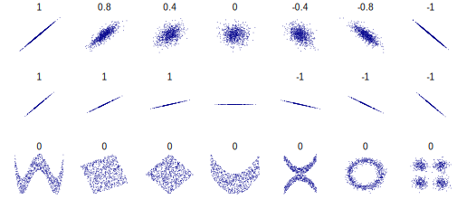

```{r}
#| echo: false
#| warning: false
#| eval: true
library(tidyverse, quietly = TRUE)
library(infer, quietly = TRUE)
library(patchwork, quietly = TRUE)
library(palmerpenguins, quietly = TRUE)

theme_set(cowplot::theme_cowplot(font_family = "Atkinson Hyperlegible") + theme(aspect.ratio = 1, legend.position = "none"))
```

# Correlation {background-color="#61599d"}

## Correlation
### Do two continuous variables covary?

- Used to assess if two continuous variables are independent, or if they covary (linearly)
- We do not express one variable as a function of another:
  - No "response" and "explanatory"
- Usually assumed that both variables are caused by the same thing
- "Correlation does not mean causation"
  - But you can measure a correlation between a cause and effect

## Correlation
### Do two continuous variables covary?

Correlation coefficient (Pearson):

$$
r = \frac{\sum_{i=1}^n (x_i - \bar{x})(y_i - \bar{y})}{\sqrt{\sum_{i=1}^n (x_i - \bar{x})^2} \sqrt{\sum_{i=1}^n (y_i - \bar{y})^2}}
$$

$$
r = \frac{\text{Covariance}(x,y)}{\text{Standard deviation}(x) \times \text{Standard deviation}(y)}
$$

$$
r = \frac{\text{Cov}(x,y)}{\sigma_x \sigma_y}
$$

## Correlation
### Do two continuous variables covary?

```{r}
#| echo: false
#| eval: true
#| fig-align: center
#| fig-width: 10
set.seed(122)
data <- tibble(
  x = rnorm(100, mean = 50, sd = 10),
  y = x + rnorm(100, mean = 0, sd = 5)
) |>
mutate(y = mean(y) - 0.3*(mean(y) - y))


scatterplot <-
data |>
  ggplot(aes(x = x, y = y)) +
  geom_point(alpha = 0.5, size = 3) +
  lims(x = c(20,80), y = c(20,80))

x_plot <-
data |>
  ggplot(aes(x = x, y = "1")) +
  geom_jitter(height = 0, alpha = 0.2, size = 3) +
  geom_vline(aes(xintercept = mean(x)), color = "red", linetype = "dashed") +
  theme(
    axis.title.y = element_blank(),
    axis.text.y = element_blank(),
    axis.ticks.y = element_blank(),
    axis.line.y = element_blank()
  ) +
  lims(x = c(20,80))

y_plot <-
data |>
  ggplot(aes(x = "1", y = y)) +
  geom_jitter(width = 0, alpha = 0.2, size = 3) +
  geom_hline(aes(yintercept = mean(y)), color = "red", linetype = "dashed") +
  theme(
    axis.title.x = element_blank(),
    axis.text.x = element_blank(),
    axis.ticks.x = element_blank(),
    axis.line.x = element_blank()
  ) +
  lims(y = c(20,80))

```

::: {.columns}
::::: {.column}
$$
r = \frac{\text{Cov}(x,y)}{\sigma_x \sigma_y}
$$
:::::
::::: {.column}
```{r}
#| echo: false
#| eval: true
scatterplot
```
:::::
:::

## Correlation
### Do two continuous variables covary?

::: {.columns}
::::: {.column}
$$
r = \frac{\text{Cov}(x,y)}{\sigma_x \sigma_y}
$$

Calculate standard deviation in $x$:

$$
\sigma_x = \sqrt{\sum_{i=1}^n (x_i - \bar{x})^2}
$$

```{r}
#| echo: true
#| eval: true
data |>
  observe(response = x, stat = "sd")
```

:::::
::::: {.column}
```{r}
#| echo: false
#| eval: true
x_plot
```
:::::
:::

## Correlation
### Do two continuous variables covary?

::: {.columns}
::::: {.column}
$$
r = \frac{\text{Cov}(x,y)}{\sigma_x \sigma_y}
$$

Calculate standard deviation in $y$:

$$
\sigma_y = \sqrt{\sum_{i=1}^n (y_i - \bar{y})^2}
$$

```{r}
#| echo: true
#| eval: true
data |>
  observe(response = y, stat = "sd")
```

:::::
::::: {.column}
```{r}
#| echo: false
#| eval: true
y_plot
```
:::::
:::

## Correlation
### Do two continuous variables covary?

::: {.columns}
::::: {.column}
$$
r = \frac{\text{Cov}(x,y)}{\sigma_x \sigma_y}
$$

Calculate the covariance between $x$ and $y$:

$$
Cov(x,y) = \sum_{i=1}^n (x_i - \bar{x})(y_i - \bar{y})
$$

```{r}
#| echo: true
#| eval: true
data |>
  cov()
```
:::::
::::: {.column}
```{r}
#| echo: false
#| eval: true
scatterplot + 
geom_hline(aes(yintercept = mean(y)), color = "red", linetype = "dashed") +
geom_vline(aes(xintercept = mean(x)), color = "red", linetype = "dashed")
```
:::::
:::

## Correlation
### Do two continuous variables covary?

::: {.columns}
::::: {.column}
$$
r = \frac{\text{Cov}(x,y)}{\sigma_x \sigma_y}
$$

```{r}
#| echo: true
#| eval: true
data |>
  specify(x ~ y) |>
  calculate(stat = "correlation")
```
:::::
::::: {.column}
```{r}
#| echo: false
#| eval: true
scatterplot
```
:::::
:::

## Correlation
### Do two continuous variables covary?

{fig-align="center"}

## Correlation
### Do two continuous variables covary?

Correlation coefficient ($r$):
$$
r = \frac{\sum_{i=1}^n (x_i - \bar{x})(y_i - \bar{y})}{\sqrt{\sum_{i=1}^n (x_i - \bar{x})^2} \sqrt{\sum_{i=1}^n (y_i - \bar{y})^2}}
$$

Coefficient of determination ($r^2$):
$$
r^2 = \left(\frac{\sum_{i=1}^n (x_i - \bar{x})(y_i - \bar{y})}{\sqrt{\sum_{i=1}^n (x_i - \bar{x})^2} \sqrt{\sum_{i=1}^n (y_i - \bar{y})^2}}\right)^2
$$

## Correlation
### Do two continuous variables covary?

```{r}
#| fig-width: 10
set.seed(123)

# Dataset 1: Strong positive correlation
data1 <- tibble(
  x = rnorm(100, mean = 50, sd = 10),
  y = x + rnorm(100, mean = 0, sd = 5)
)

# Dataset 2: Moderate positive correlation
data2 <- tibble(
  x = rnorm(100, mean = 50, sd = 10),
  y = rnorm(100, mean = 50, sd = 10)
)

# Dataset 3: Weak positive correlation
data3 <- tibble(
  x = rnorm(100, mean = 50, sd = 10),
  y = -x + rnorm(100, mean = 0, sd = 10)
)

# Calculate r and r-squared for each dataset
calculate_stats <- function(data) {
  r <- cor(data$x, data$y)
  r_squared <- r^2
  paste0("r = ", round(r, 2), ", r2 = ", round(r_squared, 2))
}

stats1 <- calculate_stats(data1)
stats2 <- calculate_stats(data2)
stats3 <- calculate_stats(data3)

# Combine datasets for visualization
data_combined <- bind_rows(
  data1 |> mutate(dataset = stats1),
  data2 |> mutate(dataset = stats2),
  data3 |> mutate(dataset = stats3)
)

# Plot the datasets
data_combined |>
  ggplot(aes(x = x, y = y, color = dataset)) +
  geom_point(alpha = 0.7, size = 3) +
  facet_wrap(~dataset, scale = "free") +
  theme(
    strip.text = element_text(size = 14),
    panel.background = element_blank()
  )
```

## Correlation
### Do two continuous variables covary?

```{r}
#| echo: true
#| output-location: column
adelie_data <-
  penguins |>
  filter(species == "Adelie")
  
adelie_data |>
  ggplot(aes(x = flipper_length_mm, y = body_mass_g)) +
  geom_point(size = 3, alpha = 0.7)
```

## Correlation
### Observed statistic

```{r}
#| echo: true
observed_correlation <-
  adelie_data |>
  specify(flipper_length_mm ~ body_mass_g) |>
  calculate(stat = "correlation")

observed_correlation
```

## Correlation
### Confidence intervals

```{r}
#| echo: true

boot_dist <-
  adelie_data |>
  specify(flipper_length_mm ~ body_mass_g) |>
  generate(reps = 10000, type = "bootstrap") |>
  calculate(stat = "correlation")

percentile_ci <- 
    boot_dist |>
    get_ci(level = 0.95, type = "percentile")
```

## Correlation
### Confidence intervals

```{r}
#| echo: true
boot_dist |>
  visualize() +
  shade_confidence_interval(endpoints = percentile_ci) +
  labs(x = "r")
```

## Correlation
### Confidence intervals

- The correlation between flipper length and body mass was 0.468 (95% CI: 0.355, 0.572).

## Correlation
### Hypothesis test

- Null hypothesis:
  - The two variables do not covary ($r=0$)
- Alternative hypothesis:
  - The two variables do covary ($r\neq0$)

## Correlation
### Hypothesis test

- How could we generate a null distribution?

```{r}
base_plot <-
adelie_data |>
  ggplot(aes(x = flipper_length_mm, y = body_mass_g)) +
  geom_point(size = 3, alpha = 0.7)

base_plot
```

## Correlation
### Hypothesis test

```{r}
#| fig-width: 10
reps_dat <-
  adelie_data |>
  specify(flipper_length_mm ~ body_mass_g) |>
  hypothesize(null = "independence") |>
  generate(reps = 25, type = "permute")

reps <-
reps_dat |>
  ggplot(aes(x = flipper_length_mm, y = body_mass_g)) +
  geom_point(size = 1, alpha = 0.3) +
  geom_label(data = calculate(reps_dat, stat = "correlation"), aes(label = round(stat, 2), x = mean(adelie_data$flipper_length_mm, na.rm = TRUE), y = mean(adelie_data$body_mass_g, na.rm = TRUE)), size = 4, colour = "red") +
  facet_wrap(~replicate) +
  cowplot::panel_border() +
  theme(
    axis.title = element_blank(),
    strip.text = element_blank()
  )

base_plot + reps
```

## Correlation
### Hypothesis test

```{r}
#| echo: true
null_dist <-
  adelie_data |>
  specify(flipper_length_mm ~ body_mass_g) |>
  hypothesize(null = "independence") |>
  generate(reps = 10000, type = "permute") |>
  calculate(stat = "correlation")
```

## Correlation
### Hypothesis test

```{r}
#| echo: true
null_dist |>
  visualize() +
  shade_p_value(obs_stat = observed_correlation, direction = "two-sided")
```

## Correlation
### Hypothesis test

```{r}
#| echo: true
null_dist |>
  get_p_value(obs_stat = observed_correlation, direction = "two-sided")
```

- Remember that our p-value is an approximation
  - The number of decimal places of accuracy we can observe is directly linked to the number of `reps`

# Linear Regression {background-color="#61599d"}

- When your response is a quantitative variable, and you want to predict it using (at least) one other quantitative
  variable

## Linear Regression
### How does variable Y depend on variable X

- A mathematical function describing the relationship between two continuous variables
- Y is dependant on X (the)
- Y is a function of X
- Predictive model
- Very powerful framework

## Linear Regression
### How does variable Y depend on variable X

$$
y = \text{Slope}\times x + \text{Intercept}
$$

$$
y = mx+c
$$

$$
y = \beta_1x+\beta_0
$$

$$
y = \beta_0+\beta_1x+\beta_2x_2+\beta_3x_3+\beta_4x_4+\beta_5x_5
$$

## Linear Regression
### How does variable Y depend on variable X

```{r}
#| fig-width: 10
# Generate a range of intercept and slope values
intercepts <- seq(-10, 10, by = 5)
slopes <- 1

# Create a grid of intercept and slope combinations
abline_data <- expand.grid(intercept = intercepts, slope = slopes)

# Generate a dataset for plotting
plot_data <- tibble(x = seq(-10, 10, length.out = 100))

# Add lines for each intercept and slope combination
abline_data <- abline_data |>
  rowwise() |>
  mutate(
    line_data = list(plot_data |> mutate(y = slope * x + intercept))
  ) |>
  unnest(line_data)

# Plot the lines
intercept_plot <-
abline_data |>
  ggplot(aes(x = x, y = y, color = as.factor(intercept))) +
  geom_line() +
  labs(
    title = "Effect of Changing Intercept",
    x = "X",
    y = "Y",
    color = "Intercept"
  ) +
  coord_cartesian(xlim = c(0, 10), expand = FALSE) +
  theme(legend.position = "left")
# Generate a range of intercept and slope values
intercepts <- 0
slopes <- seq(-5, 5, by = 2)

# Create a grid of intercept and slope combinations
abline_data <- expand.grid(intercept = intercepts, slope = slopes)

# Generate a dataset for plotting
plot_data <- tibble(x = seq(-10, 10, length.out = 100))

# Add lines for each intercept and slope combination
abline_data <- abline_data |>
  rowwise() |>
  mutate(
    line_data = list(plot_data |> mutate(y = slope * x + intercept))
  ) |>
  unnest(line_data)

# Plot the lines
slope_plot <-
abline_data |>
  ggplot(aes(x = x, y = y, color = as.factor(slope))) +
  geom_line() +
  labs(
    title = "Effect of Changing Slope",
    x = "X",
    y = "Y",
    color = "Slope"
  ) +
  coord_cartesian(xlim = c(0, 10), expand = FALSE) +
  theme(legend.position = "right")

intercept_plot + slope_plot
```

## Linear Regression
### How does variable Y depend on variable X

```{r}
#| fig-width: 10
calculate_stats <- function(data) {
  model <- lm(y ~ x, data = data)
  intercept <- coef(model)[1]
  slope <- coef(model)[2]
  paste0("Intercept = ", round(intercept, 2), ", Slope = ", round(slope, 2))
}

stats1 <- calculate_stats(data1)
stats2 <- calculate_stats(data2)
stats3 <- calculate_stats(data3)

# Combine datasets for visualization
data_combined <- bind_rows(
  data1 |> mutate(dataset = stats1),
  data2 |> mutate(dataset = stats2),
  data3 |> mutate(dataset = stats3)
)

data_combined |>
  ggplot(aes(x = x, y = y, color = dataset)) +
  geom_smooth(method = "lm", se = FALSE) +
  geom_point(alpha = 0.7, size = 3) +
  facet_wrap(~dataset, scale = "free") +
  theme(
    strip.text = element_text(size = 14),
    panel.background = element_blank()
  )
```

## Linear Regression
### How does variable Y depend on variable X

- Example: For sexual selection to operate, an increase in mating success (number of mates) must result in an increase
  in reproductive success (number of offspring).

```{r}
#| fig-align: center
set.seed(123)
# Generate two positively correlated variables
x <- rlnorm(100, meanlog = log(5), sdlog = log(1.5))
y <- 4 * x + rnorm(100, mean = 0, sd = 10)


# Combine into a tibble
mating_data <- tibble(x = round(x, 0), y = round(y, 0)) |> mutate(y = if_else(x < 6, y - (y - 10) * 0.2, y)) |> mutate(y = if_else(y < 0, 0, y))

# Visualize the relationship
sex_plot <-
mating_data |>
  ggplot(aes(x = x, y = y)) +
  geom_point(alpha = 0.5, size = 3) +
  geom_smooth(method = "lm", se = FALSE) +
  labs(x = "Mating success", y = "Reproductive success")

sex_plot

mating_data <- mating_data |> rename(mating_success = x, reproductive_success = y)

```

## Linear Regression
### How does variable Y depend on variable X

::: {.columns}
::::: {.column}
$$
y = \beta_1x+\beta_0
$$

$$
y = 3.83x-0.68
$$

- $\beta_1$ = strength of sexual selection
- For each additional mate, an individual (on average) gains $\beta_1$ additional offspring
- For 5 mates ($x=5$):
  - $y = 3.83\times5-0.68$
  - $y = 18.47$
:::::
::::: {.column}
```{r}
sex_plot
```
:::::
:::

## Linear Regression
### How does variable Y depend on variable X

```{r}
#| fig-align: center
# Fit a linear model
data1 <- slice_sample(data1, n = 20)
# Create a second dataset with a poorly fitting line
model1 <- lm(y ~ x, data = data1)

# Add residuals and squared residuals to the first dataset
data_with_residuals1 <- data1 |>
  mutate(
    fitted = predict(model1),
    residual = y - fitted,
    squared_residual = residual^2
  )

model2 <- lm(y ~ x, data = data1)

model2$coefficients[1] <- -10
model2$coefficients[2] <- 1.3

# Add residuals and squared residuals to the second dataset
data_with_residuals2 <- data1 |>
  mutate(
    fitted = predict(model2),
    residual = y - fitted,
    squared_residual = residual^2
  )

# Plot the data with squared residuals
data_with_residuals1 |>
  ggplot(aes(x = x, y = y)) +
  geom_point(alpha = 0.7, size = 3) +
  geom_line(aes(y = fitted), color = "blue", linetype = "solid", linewidth = 2) +
  coord_cartesian(xlim=c(20,80), ylim=c(20,80))
  #geom_segment(aes(xend = x, yend = fitted), color = "red", alpha = 0.5) 
  #geom_point(aes(y = fitted + squared_residual), color = "purple", size = 2, alpha = 0.7) +
```

## Linear Regression
### How does variable Y depend on variable X

```{r}
#| fig-align: center
data_with_residuals1 |>
  ggplot(aes(x = x, y = y)) +
  geom_point(alpha = 0.7, size = 3) +
  geom_line(aes(y = fitted), color = "blue", linetype = "solid", linewidth = 2) +
  geom_segment(aes(xend = x, yend = fitted), color = "red", alpha = 0.5) +
  coord_cartesian(xlim=c(20,80), ylim=c(20,80))
```

## Linear Regression
### How does variable Y depend on variable X

```{r}
#| fig-align: center
data_with_residuals1 |>
  ggplot(aes(x = x, y = y)) +
  geom_point(alpha = 0.7, size = 3) +
  geom_line(aes(y = fitted), color = "blue", linetype = "solid", linewidth = 2) +
  geom_rect(aes(
    xmin = x - sqrt(squared_residual) / 2,
    xmax = x + sqrt(squared_residual) / 2,
    ymin = pmin(y, fitted),
    ymax = pmax(y, fitted)
  ), fill = "red", alpha = 0.3) +
  coord_cartesian(xlim=c(20,80), ylim=c(20,80))

```

## Linear Regression
### How does variable Y depend on variable X

```{r}
#| fig-align: center
data_with_residuals2 |>
  ggplot(aes(x = x, y = y)) +
  geom_point(alpha = 0.7, size = 3) +
  geom_line(aes(y = fitted), color = "blue", linetype = "solid", linewidth = 2) +
  geom_rect(aes(
    xmin = x - sqrt(squared_residual) / 2,
    xmax = x + sqrt(squared_residual) / 2,
    ymin = pmin(y, fitted),
    ymax = pmax(y, fitted)
  ), fill = "red", alpha = 0.3) +
  coord_cartesian(xlim=c(20,80), ylim=c(20,80))
```

## Linear Regression

::: {.columns}
::::: {.column}
```{r}
data_with_residuals1 |>
  ggplot(aes(x = x, y = y)) +
  geom_point(alpha = 0.7, size = 3) +
  geom_line(aes(y = fitted), color = "blue", linetype = "solid", linewidth = 2) +
  geom_rect(aes(
    xmin = x - sqrt(squared_residual) / 2,
    xmax = x + sqrt(squared_residual) / 2,
    ymin = pmin(y, fitted),
    ymax = pmax(y, fitted)
  ), fill = "red", alpha = 0.3) +
  coord_cartesian(xlim=c(20,80), ylim=c(20,80))

```
:::::
::::: {.column}
- Fit by solving to minimise the sum of the squared residuals (SSR)
  - Find $\beta_1$ and $\beta_0$ that minimise the SSR
  - Called a "loss function"
:::::
:::

## Linear Regression
### How does variable Y depend on variable X



## Linear Regression
### How to fit a slope in R?

With `infer` (if no interest in the intercept):

```{r}
#| echo: true
observed_fit <-
  mating_data |>
  specify(reproductive_success ~ mating_success) |>
  calculate(stat = "slope")

observed_fit
```

## Linear Regression
### Confidence intervals for a slope

```{r}
#| echo: true
boot_dist <-
  mating_data |>
  specify(reproductive_success ~ mating_success) |>
  generate(reps = 1000, type = "bootstrap") |>
  calculate(stat = "slope")

boot_dist
```

## Linear Regression
### Confidence intervals for a slope

```{r}
#| echo: true
conf_ints <- 
  boot_dist |>
  get_confidence_interval(level = 0.95, type = "percentile")

conf_ints
```

## Linear Regression
### Confidence intervals for a slope

```{r}
#| echo: true
boot_dist |>
  visualize() +
  shade_confidence_interval(endpoints = conf_ints)
```

## Linear Regression
### Confidence intervals for a slope

```{r}
#| echo: true
boot_dist |>
  visualize() +
  shade_confidence_interval(endpoints = conf_ints)
```

## Linear Regression
### Hypothesis test for a slope

- Null hypothesis:
  - Slope = 0
- Alternative hypothesis:
  - Slope $\neq$ 0
  - Slope < 0
  - Slope > 0

## Linear Regression
### Hypothesis test for a slope

```{r}
#| echo: true
null_dist <-
  mating_data |>
  specify(reproductive_success ~ mating_success) |>
  hypothesize(null = "independence") |>
  generate(reps = 1000, type = "permute") |>
  calculate(stat = "slope")

null_dist
```

## Linear Regression
### Hypothesis test for a slope

```{r}
#| echo: true
visualize(null_dist) +
  shade_p_value(obs_stat = observed_fit, direction = "two-sided")
```

## Linear Regression
### Multiple linear regression

$$
y = \beta_1x+\beta_0
$$

$$
y = \beta_0+\beta_1x+\beta_2x_2+\beta_3x_3+\beta_4x_4+\beta_5x_5...
$$

## Linear Regression
### Multiple linear regression: **intercept only model**

::: {.columns}
::::: {.column}
```{r}
#| echo: false
#| eval: true
penguins |>
    ggplot(aes(x = body_mass_g, y = flipper_length_mm)) +
    geom_point(aes(color = species), size = 3, alpha = 0.7) +
    geom_hline(yintercept = 200, colour = "blue", size = 1) +
    labs(
        x = "Body Mass (g)",
        y = "Flipper Length (mm)",
        color = "Species"
    )+
    theme(legend.position = "bottom")
```
:::::
::::: {.column}
$$
\text{flipper_length_mm} = \beta_0
$$

```{r}
#| echo: true
penguins |>
  specify(response = flipper_length_mm) |>
  fit()
```

:::::
:::

## Linear Regression
### Multiple linear regression: **intercept and slope model**

::: {.columns}
::::: {.column}
```{r}
#| echo: false
#| eval: true
penguins |>
    ggplot(aes(x = body_mass_g, y = flipper_length_mm)) +
    geom_point(aes(color = species), size = 3, alpha = 0.7) +
    geom_smooth(method = "lm", se = FALSE) +
    labs(
        x = "Body Mass (g)",
        y = "Flipper Length (mm)",
        color = "Species"
    )+
    theme(legend.position = "bottom")
```
:::::
::::: {.column}
$$
\text{flipper_length_mm} = \beta_0+ \\
\beta_1 \times \text{body_mass_g}
$$

```{r}
#| echo: true
penguins |>
  specify(response = flipper_length_mm, explanatory = body_mass_g) |>
  fit()
```
:::::
:::

## Linear Regression
### Multiple linear regression: **additive model with parallel slopes (ANCOVA)**

::: {.columns}
::::: {.column}
```{r}
#| echo: false
#| eval: true

mod <- lm(flipper_length_mm~body_mass_g+species, data = penguins)

penguins |>
    ggplot(aes(x = body_mass_g, y = flipper_length_mm, color = species)) +
    geom_point(size = 3, alpha = 0.7) +
    geom_segment(
        data = tibble(
            species = factor(c("Adelie", "Chinstrap", "Gentoo"), levels = levels(penguins$species)),
            intercept = c(
                coef(mod)[1],
                coef(mod)[1] + coef(mod)["speciesChinstrap"],
                coef(mod)[1] + coef(mod)["speciesGentoo"]
            ),
            slope = coef(mod)["body_mass_g"]
        ) |>
            mutate(
                x_start = min(penguins$body_mass_g, na.rm = TRUE),
                x_end = max(penguins$body_mass_g, na.rm = TRUE),
                y_start = intercept + slope * x_start,
                y_end = intercept + slope * x_end
            ),
        aes(x = x_start, xend = x_end, y = y_start, yend = y_end, color = species),
        inherit.aes = FALSE,
        linewidth = 1
    ) +
    labs(
        x = "Body Mass (g)",
        y = "Flipper Length (mm)",
        color = "Species"
    ) +
    theme(legend.position = "bottom")
```
:::::
::::: {.column}
$$
\text{flipper_length_mm} = \beta_0+ \\
\beta_1 \times \text{body_mass_g}+ \\
\beta_2 \times \text{species}
$$

```{r}
#| echo: true
penguins |>
  specify(flipper_length_mm ~ body_mass_g + species) |>
  fit()
```
:::::
:::

## Linear Regression
### Multiple linear regression: **interaction model**

::: {.columns}
::::: {.column}
```{r}
#| echo: false
#| eval: true

mod <- lm(flipper_length_mm~body_mass_g*species, data = penguins)

penguins |>
    ggplot(aes(x = body_mass_g, y = flipper_length_mm, color = species)) +
    geom_point(size = 3, alpha = 0.7) +
    geom_segment(
        data = tibble(
            species = factor(c("Adelie", "Chinstrap", "Gentoo"), levels = levels(penguins$species)),
            intercept = c(
                coef(mod)[1],
                coef(mod)[1] + coef(mod)["speciesChinstrap"],
                coef(mod)[1] + coef(mod)["speciesGentoo"]
            ),
            slope = c(
                coef(mod)["body_mass_g"],
                coef(mod)["body_mass_g"] + coef(mod)["body_mass_g:speciesChinstrap"],
                coef(mod)["body_mass_g"] + coef(mod)["body_mass_g:speciesGentoo"]
            )
        ) |>
            mutate(
                x_start = min(penguins$body_mass_g, na.rm = TRUE),
                x_end = max(penguins$body_mass_g, na.rm = TRUE),
                y_start = intercept + slope * x_start,
                y_end = intercept + slope * x_end
            ),
        aes(x = x_start, xend = x_end, y = y_start, yend = y_end, color = species),
        inherit.aes = FALSE,
        linewidth = 1
    ) +
    labs(
        x = "Body Mass (g)",
        y = "Flipper Length (mm)",
        color = "Species"
    ) +
    theme(legend.position = "bottom")
```
:::::
::::: {.column}
$$
\text{flipper_length_mm} = \beta_0 + \\
\beta_1 \times \text{body_mass_g} + \\
\beta_2 \times \text{species} + \\
\beta_3 \times \text{body_mass_g} \times \text{species}
$$

```{r}
#| echo: true
penguins |>
  specify(flipper_length_mm ~ body_mass_g * species) |>
  fit()
```

:::::
:::

## Linear Regression
### Multiple linear regression

- The methods used in `infer` for hypothesis testing in multiple linear regression are a bit limited.
  - Need to move to `parsnip` package or base R `lm()` function.
  - Bit beyond this course, but you will learn it when you need to (hard to avoid!)
- Super powerful framework

# Logistic Regression {background-color="#61599d"}

- When your response is a binomial (categorical variable with two levels), and you want to predict it using (at least)
  one quantitative variable

## Logistic Regression
### Predicting a binomial response with a quantitative variable

```{r}
penguins |>
    filter(species %in% c("Adelie", "Gentoo")) |>
        ggplot(aes(x = body_mass_g, y = species)) +
        geom_jitter(height = 0.2, alpha = 0.5, size = 3) +
        labs(
            x = "Body Mass (g)",
            y = "Species"
        )
```

## Logistic Regression
### Predicting a binomial response with a quantitative variable

- Type of generalized linear model (GLM)
- Two categories are treated as 0 or 1.
- Requires a transformation of the response variable, the probability of being 1, $p$
  - Linear regression is a straight line
  - Will predict values less than 0 or more than 1

## Logistic Regression
### Logit transformation

$$
\text{logit}(p) = \log\left(\frac{p}{1-p}\right)
$$

- When $p=0.5$ (equally likely either species), $\text{logit}(p)=0$
- When $p$ approaches 1 (almost certainly Gentoo), $\text{logit}(p)$ approaches $+\infty$
- When $p$ approaches 0 (almost certainly Adelie), $\text{logit}(p)$ approaches $-\infty$

$$
\text{logit}(p) = \beta_0+\beta_1x+\beta_2x_2+...
$$

## Logistic Regression
### Logit transformation

```{r}
logit_data <- tibble(
    p = seq(0.001, 0.999, length.out = 1000),
    logit_p = log(p / (1 - p))
)

logit_data |>
    ggplot(aes(x = p, y = logit_p)) +
    geom_line(linewidth = 1) +
    geom_hline(yintercept = 0, linetype = "dashed", color = "red", alpha = 0.5) +
    geom_vline(xintercept = 0.5, linetype = "dashed", color = "red", alpha = 0.5) +
    labs(
        x = "Probability (p)",
        y = "logit(p)",
        title = "Logit Transformation"
    )
```

## Logistic Regression
### Inverse logit transformation

- After fitting a logistic regression model on the logit scale, you get predictions in logit units.
- The inverse logit transforms them back to probabilities (0–1).

$$
p = \frac{e^{\beta_0+\beta_1x...}}{1 + e^{\beta_0+\beta_1x...}}
$$

## Logistic Regression
### How to fit in R

::: {.columns}
::::: {.column}
```{r}
penguins |>
    filter(species %in% c("Adelie", "Gentoo")) |>
    mutate(species_binary = as.numeric(species == "Gentoo")) |>
    ggplot(aes(x = body_mass_g, y = species_binary)) +
    geom_jitter(height = 0.05, alpha = 0.5, size = 3) +
    geom_smooth(method = "glm", method.args = list(family = "binomial"), se = FALSE, color = "blue") +
    labs(
        x = "Body Mass (g)",
        y = "Species (0 = Adelie, 1 = Gentoo)"
    ) +
    scale_y_continuous(breaks = c(0, 1), limits = c(-0.2, 1.2))
```
:::::
::::: {.column}
$$
\text{logit}(p) = \beta_0 + \beta_1 \times \text{body_mass_g}
$$

```{r}
#| echo: true
penguins |>
  filter(species == "Adelie" | species == "Gentoo") |>
  specify(species ~ body_mass_g) |>
  fit()
```

:::::
:::

## Logistic Regression
### Interpreting coefficients: **intercept**

$\beta_0 \approx -27.5$

- Predicted logit when `body_mass_g = 0`
- When body mass = 0 grams: $p \approx 0$ (almost certainly Adelie)
- Rarely interpretable (0 grams is biologically impossible)

## Logistic Regression
### Interpreting coefficients: **slope**

$\beta_1 \approx 0.00623$

- For each additional gram of body mass, log-odds increase by 0.00623
- Odds ratio: $e^{0.00623} \approx 1.0062$
- Each gram of body mass multiplies the odds of being Gentoo by 1.0062
- A 100 gram difference: $1.0062^{100} \approx 1.87$ times higher odds }

## Logistic Regression
### Interpreting coefficients
$$
\text{logit}(p) = -27.5 + 0.00623 \times \text{body_mass_g}
$$

Inverse logit (to get probability):
$$
p = \frac{e^{\text{logit}(p)}}{1 + e^{\text{logit}(p)}}
$$

```{r}
#| echo: true
# logit scale prediction
logit_pred <- -27.5 + 0.00623 * 4500

# convert to probability
prob_pred <- plogis(logit_pred)
prob_pred
```

## Logistic Regression
### Multiple logisitic regression

- The methods used in `infer` for hypothesis testing in multiple logistic regression are a bit limited.
  - Need to move to `parsnip` package.
  - Bit beyond this course, but you will learn it when you need to (hard to avoid!)
- Super powerful framework
