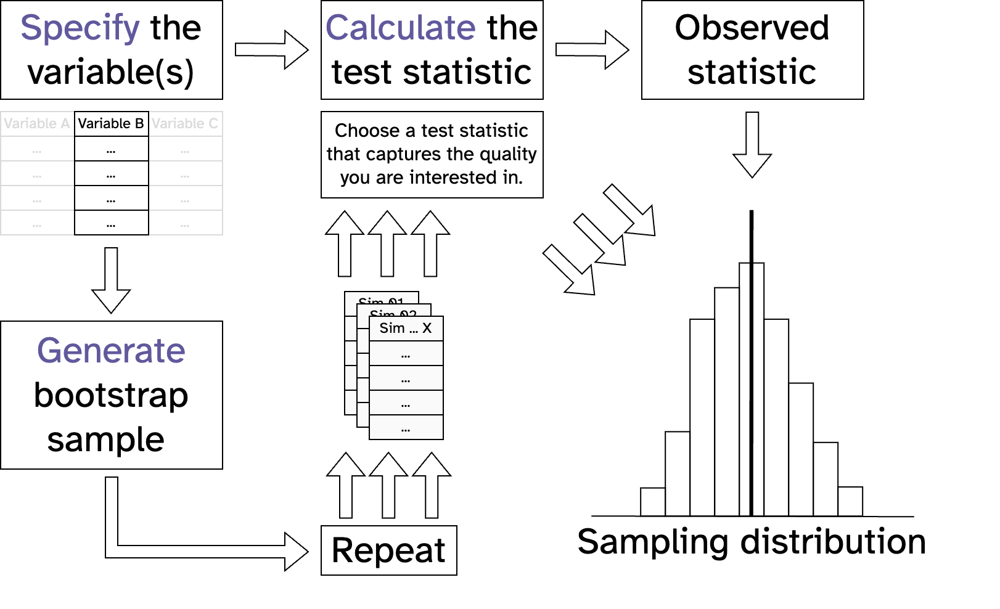
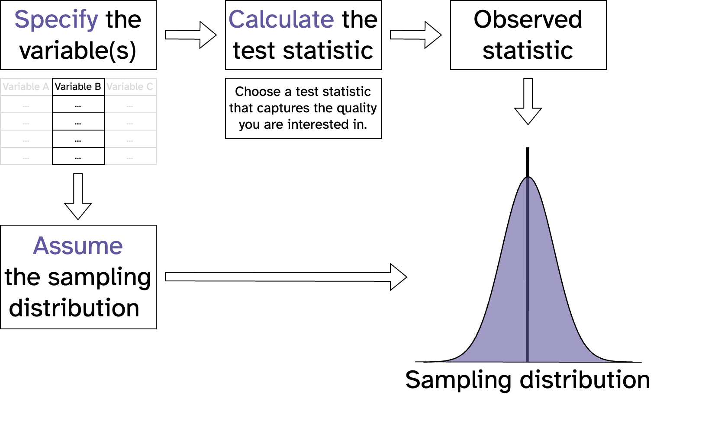
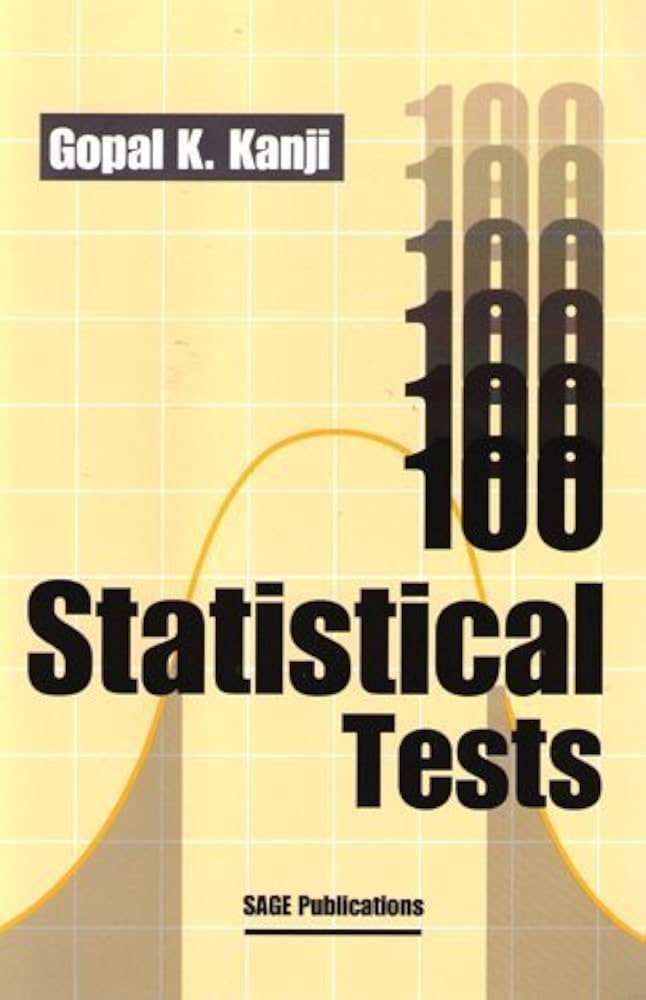
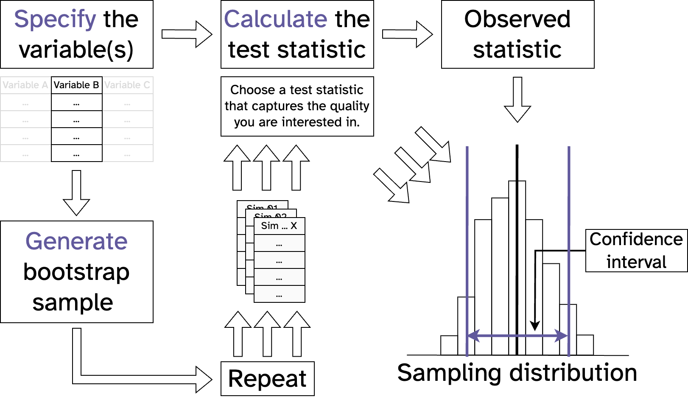
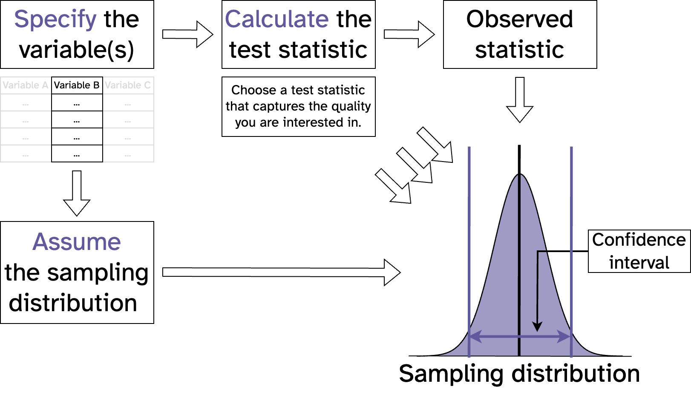
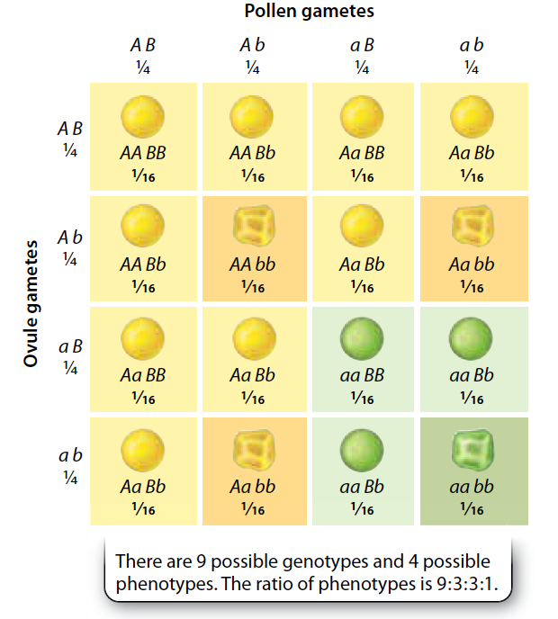
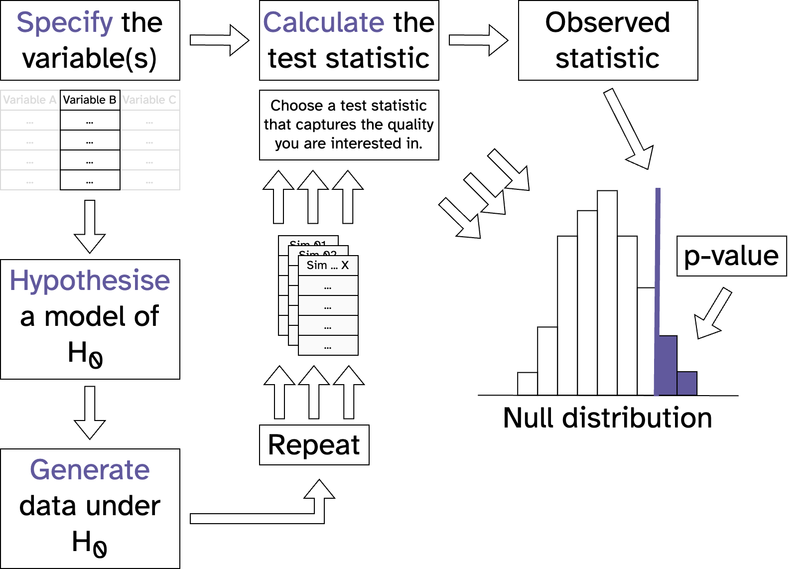
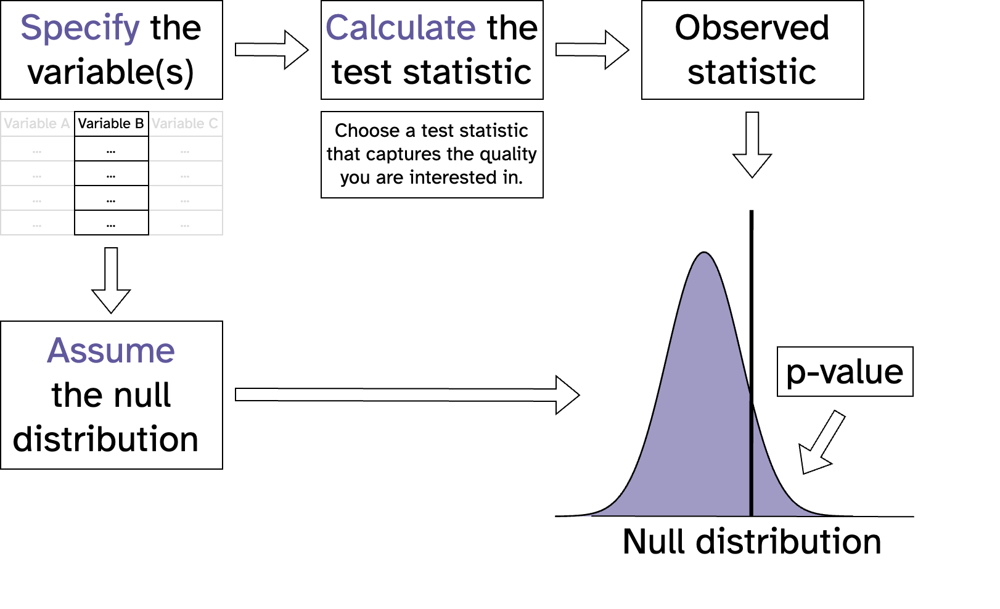



# Making an error {background-color="#61599d"}

```{r}
library(tidyverse, quietly = TRUE)
library(infer, quietly = TRUE)
library(patchwork, quietly = TRUE)
library(palmerpenguins, quietly = TRUE)

theme_set(cowplot::theme_cowplot(font_family = "Atkinson Hyperlegible") + theme(aspect.ratio = 1, legend.position = "none"))
```

```{webr}
#| edit: false
#| echo: false
#| output: false
library(tidyverse)
library(infer)
library(palmerpenguins)

theme_set(theme_bw(base_size = 16) + theme(aspect.ratio = 1))

# Generate expected data under Mendelian laws for a dihybrid cross
set.seed(123) # For reproducibility

# Define expected proportions for a dihybrid cross (9:3:3:1 ratio)
expected_proportions <- c(8.7, 2.5, 3.5, 1.3) / 16

# Generate a dataset with 160 observations (to match proportions)
mendelian_data <- tibble(
  phenotype = rep(c("A-B-", "A-bb", "aaB-", "aabb"), times = round(expected_proportions * 120))
)
```

## Making an error
### Logic of hypothesis testing (review)

- What are the chances we would collect the data we did if the null hypothesis was true?
- What are the chances we would have observed our test statistic or a more extreme one, if the null hypothesis was
  correct?
- This probability is called a **p-value**
  - If the chance (p-value) is sufficiently low ($p < \alpha$), then we **reject the null hypothesis**
  - If the chance (p-value) is high ($p \ge \alpha$), then we **fail to reject the null hypothesis**

## Making an error
### Types of error (hypothesis testing)

We want to find a balance between two types of errors we could make:

- $\alpha$: **type I error** (false positive)
  - Null hypothesis is TRUE, but we reject it
- $\beta$: **type II error** (false negative)
  - Null hypothesis is FALSE, but we fail to reject it

## Making an error
### Types of error (hypothesis testing)

- To decrease our chance of making a **type I error** (false positive):
  - Decrease our $\alpha$
  - p = 0.05, p = 0.01, p = 0.001?
- However, this increases our chance of making a **type II error** (false negative):
- To decrease our chance of making a **type II error**:
  - Increase our sample size
  - Increase $\alpha$
- Can also view p-values as a continuum

## Making an error
### Types of error (hypothesis testing)

```{r}
#| echo: false
#| eval: true
#| fig-align: center
#| fig-width: 8
#| fig-height: 8
set.seed(123)

# Simulate data under the null hypothesis (no true effect)
# Test at different sample sizes to show Type I error rate stays constant

sample_sizes <- c(10, 50, 100, 500)
n_simulations <- 10000
alpha <- 0.05

results <- map_df(sample_sizes, \(n) {
    p_values <- replicate(n_simulations, {
        # Generate data from normal distribution (null is true)
        data <- rnorm(n, mean = 0, sd = 1)
        # Test if mean differs from 0
        t_test <- t.test(data, mu = 0)
        t_test$p.value
    })
    
    # Count rejections (Type I errors)
    type_1_errors <- sum(p_values < alpha) / n_simulations
    
    tibble(
        sample_size = n,
        type_1_error_rate = type_1_errors,
        n_rejections = sum(p_values < alpha)
    )
})

ggplot(results, aes(x = factor(sample_size), y = type_1_error_rate)) +
    geom_col(fill = "steelblue", alpha = 0.7) +
    geom_hline(yintercept = alpha, linetype = "dashed", color = "coral", linewidth = 1) +
    labs(
        title = "Type I Error Rate Remains Constant Across Sample Sizes",
        subtitle = paste("10,000 simulations per sample size (alpha =", alpha, ")"),
        x = "Sample Size",
        y = "Type I Error Rate",
        caption = "When null hypothesis is true, rejection rate ≈ alpha regardless of n"
    ) +
    ylim(0, 0.1)
```

## Making an error
### Types of error (hypothesis testing)

```{r}
#| echo: false
#| eval: true
#| fig-align: center
#| fig-width: 8
#| fig-height: 8
set.seed(123)

# Simulate data under an alternative hypothesis (true effect exists)
# Test at different sample sizes to show Type II error rate decreases with larger n

sample_sizes <- c(10, 50, 100, 500)
n_simulations <- 10000
alpha <- 0.05
true_mean <- 0.5  # True effect size

results_type2 <- map_df(sample_sizes, \(n) {
    p_values <- replicate(n_simulations, {
        # Generate data from normal distribution with true effect
        data <- rnorm(n, mean = true_mean, sd = 1)
        # Test if mean differs from 0
        t_test <- t.test(data, mu = 0)
        t_test$p.value
    })
    
    # Count failures to reject (Type II errors)
    type_2_errors <- sum(p_values >= alpha) / n_simulations
    
    tibble(
        sample_size = n,
        type_2_error_rate = type_2_errors,
        power = 1 - type_2_errors
    )
})

ggplot(results_type2, aes(x = factor(sample_size), y = type_2_error_rate)) +
    geom_col(fill = "coral", alpha = 0.7) +
    labs(
        title = "Type II Error Rate Decreases with Sample Size",
        subtitle = paste("10,000 simulations per sample size (alpha =", alpha, ", true mean =", true_mean, ")"),
        x = "Sample Size",
        y = "Type II Error Rate (beta)",
        caption = "When null hypothesis is false, rejection rate increases with n"
    ) +
    ylim(0, 1)
```

# Probability models {background-color="#61599d"}

## Probability models
### Flipping a coin

- I flip a fair coin over a flat surface
- Two possible outcomes:
  - Heads
  - Tails
- Chance of heads?

## Probability models
### Flipping a coin

- 50% chance heads, why?
  - Ignorance?
  - Uncertainty?
  - Expected outcome of a lot of flips?
  - Causal process, property of the universe?

## Probability models
### Flipping a coin

- 50% chance heads, why?
  - Ignorance?
  - Uncertainty?
  - **Expected outcome of a lot of flips?**
  - Causal process, property of the universe?

## Probability models
### Flipping a coin

$$
P(\text{heads}) = \frac{\text{number of heads}}{\text{total number of flips}}
$$

$$
P(\text{success}) = \frac{\text{number of successes}}{\text{total number of trials}}
$$

- $P\ge0$
- $P\le1$

## Probability models
### Flipping two coins

- Coin 1: heads
- Coin 2: heads
- $P(\text{coin 1}=\text{heads} \cap \text{coin 2}=\text{heads}) = ?$

## Probability models
### Flipping two coins

- Coin 1: heads
- Coin 2: heads
- $P(\text{coin 1}=\text{heads} \cap \text{coin 2}=\text{heads}) = 0.5 \times 0.5 = 0.25$
- Assumes both coins are independent

## Probability models
### Influenza

- 2024/25 season in Sweden, 115/100,000 had influenza
- Probability in a class of 30 that someone has it?
- $P(\text{a given person has the flu})=115/100000=0.00115$
- $P(\text{a given person doesn't have the flu})=1-0.00115=0.99885$
- $P(\text{no one has the flu}) = 0.99885^{30} = 0.9660692$
- $P(\text{at least one has the flu}) = 1-0.9660692=0.0339308 \approx 3.4 \%$

# Probability distributions {background-color="#61599d"}

## Probability distributions
### Bimodal distribution: *flipping a coin*

```{r}
#| echo: false
#| eval: true
#| fig-align: center

tribble(
    ~"heads", ~"prob",
        "0", 0.5,
        "1", 0.5
    ) |>

ggplot(aes(x = heads, y = prob)) +
    geom_col(width = 0.5) +
    labs(
        title = "Single Coin Flip",
        x = "Number of heads",
        y = "Probability"
    ) +
    ylim(0, 1)

```

## Probability distributions
### Bimodal distribution: *flipping a coin*

- 50% chance heads, why?
  - Ignorance?
  - Uncertainty?
  - **Expected outcome of a lot of flips?**
  - Causal process, property of the universe?

## Probability distributions
### Bimodal distribution: *flipping a coin*

```{r}
#| echo: false
#| eval: true
#| fig-align: center

bimodal_coin <- 
tibble(heads = 0:10, prob = dbinom(0:10, size = 10, prob = 0.5)) |>
ggplot(aes(x = heads, y = prob)) +
    geom_col(width = 0.5) +
    labs(
        title = "10 Coin Flips",
        x = "Number of heads",
        y = "Probability"
    ) +
    ylim(0, 0.25) +
    scale_x_continuous(breaks = 0:10)

bimodal_coin

```

## Probability distributions
### Bimodal distribution: *flipping a coin*

::: {.columns}
::::: {.column}
```{r}
#| echo: false
#| eval: true
bimodal_coin
```
:::::
::::: {.column}
- $P(X=5)=0.25$
- $P(4\le X\le6)=0.25+0.2+0.2$
- $P(X \ge 9) \approx 0.011$
:::::
:::

## Probability distributions
### Bimodal distribution: *Influenza*

```{r}
#| echo: false
#| eval: true
#| fig-align: center

tibble(cases = 0:5, prob = dbinom(0:5, size = 30, prob = 0.00115)) |>
ggplot(aes(x = cases, y = prob)) +
    geom_col(width = 0.5) +
    labs(
        title = "Influenza in a Class of 30",
        x = "Number of cases",
        y = "Probability"
    ) +
    scale_x_continuous(breaks = 0:5)
```

## Probability distributions
### Bimodal distribution: *Influenza*

```{r}
#| echo: false
#| eval: true
#| fig-align: center

tibble(cases = 0:5, prob = dbinom(0:5, size = 300, prob = 0.00115)) |>
ggplot(aes(x = cases, y = prob)) +
    geom_col(width = 0.5) +
    labs(
        title = "Influenza in a Class of 300",
        x = "Number of cases",
        y = "Probability"
    ) +
    scale_x_continuous(breaks = 0:5)
```

## Probability distributions
### Bimodal distribution (no need to learn this)

$$
P(X = k) = \binom{n}{k} p^k (1-p)^{n-k}
$$

where:

- $n$ = number of trials
- $k$ = number of successes
- $p$ = probability of success on each trial
- $\binom{n}{k} = \frac{n!}{k!(n-k)!}$ = binomial coefficient

## Probability distributions
### Bimodal distribution

- A distribution is shaped by its **parameters**
- Bimodal:
  - $n$ = number of trials
  - $p$ = probability of success on each trial
- Discrete observations

## Probability distributions
### Poisson distribution

- Describes events happening over some interval (time/space)
  - Number of animals recorded by a camera trap in a day
  - Number of mutations in a DNA sequence
  - Number of typos in a presentation

## Probability distributions
### Poisson distribution (no need to learn this)

$$
P(X = k) = \frac{\lambda^k e^{-\lambda}}{k!}
$$

where:

- $k$ = number of events
- $\lambda$ = expected number of events in the interval
- $e$ = Euler's number (≈ 2.718)

## Probability distributions
### Poisson distribution

- 1 parameter:
  - $\lambda$ = expected number of events in the interval
  - Both mean and variance of distribution
- Discrete observations

## Probability distributions
### Poisson distribution

```{r}
#| echo: false
#| eval: true
#| fig-align: center

lambdas <- c(1, 3, 5, 10)

plots <- map(lambdas, \(lambda) {
    tibble(k = 0:20, prob = dpois(0:20, lambda)) |>
        ggplot(aes(x = k, y = prob)) +
        geom_col(width = 0.5) +
        labs(
            title = paste("lamda =", lambda),
            x = "Number of events",
            y = "Probability"
        ) +
        ylim(0, 0.35) +
        scale_x_continuous(breaks = seq(0, 20, 5))
})

wrap_plots(plots, ncol = 2)
```

## Probability distributions
### Probability mass functions (binomial & poisson)

- Discrete events
- $P(1.5)=0$
  - $P(between bars)=0$

## Probability distributions
### Uniform distribution

- Continuous distribution
- Two parameters: $a$ (minimum) and $b$ (maximum)

## Probability distributions
### Uniform distribution

- Not meaningful to ask probability of specific number
  - Instead look at probability of intervals

```{r}
#| echo: false
#| eval: true
#| fig-align: center

tibble(x = seq(-1, 3, 0.01), density = dunif(x, min = 0, max = 2)) |>
    ggplot(aes(x = x, y = density)) +
    geom_area(fill = "steelblue", alpha = 0.6) +
    geom_line() +
    labs(
        title = "Uniform Distribution (a = 0, b = 2)",
        x = "Value",
        y = "Probability Density"
    ) +
    ylim(0, 0.6)
```

## Probability distributions
### Normal distribution

```{r}
#| echo: false
#| eval: true
#| fig-align: center

tibble(x = seq(-4, 4, 0.01), density = dnorm(x, mean = 0, sd = 1)) |>
    ggplot(aes(x = x, y = density)) +
    geom_area(fill = "steelblue", alpha = 0.6) +
    geom_line() +
    labs(
        title = "(Standard) Normal Distribution",
        subtitle = "(μ = 0, sigma = 1)",
        x = "Value",
        y = "Probability Density"
    ) +
    ylim(0, 0.45)
```

## Probability distributions
### Normal distribution

- Continuous distribution
- Can take any real value
- Two parameters: $\mu$ (mean) and $\sigma$ (standard deviation)

## Probability distributions
### Normal distribution (no need to learn this)

$$
f(x) = \frac{1}{\sigma\sqrt{2\pi}} e^{-\frac{(x-\mu)^2}{2\sigma^2}}
$$

where:

- $\mu$ = mean
- $\sigma$ = standard deviation
- $e$ = Euler's number (≈ 2.718)
- $\pi$ = pi (≈ 3.14159)

## Probability distributions
### Normal distribution

```{r}
#| echo: false
#| eval: true
#| fig-align: center

tibble(x = seq(-4, 4, 0.01), density = dnorm(x, mean = 0, sd = 1)) |>
    ggplot(aes(x = x, y = density)) +
    geom_area(fill = "steelblue", alpha = 0.6) +
    geom_line() +
    geom_vline(xintercept = c(-1, 1), linetype = "dashed", color = "gray50") +
    geom_vline(xintercept = c(-2, 2), linetype = "dashed", color = "gray50") +
    annotate("text", x = 0, y = 0.25, label = "68.3%\n(±1 SD)", hjust = 0.5, size = 4, fontface = "bold") +
    annotate("text", x = 0, y = 0.15, label = "95.4%\n(±2 SD)", hjust = 0.5, size = 4, fontface = "bold") +
    annotate("text", x = -3, y = 0.05, label = "2.3%", hjust = 0.5, size = 3) +
    annotate("text", x = 3, y = 0.05, label = "2.3%", hjust = 0.5, size = 3) +
    labs(
        title = "(Standard) Normal Distribution",
        subtitle = "(μ = 0, sigma = 1)",
        x = "Value",
        y = "Probability Density"
    ) +
    ylim(0, 0.45)
```

## Probability distributions
### Normal distribution: Z-scores

- Standardize values from a normal distribution
- Tells us how many standard deviations away from the mean
- Formula: $z = \frac{x - \mu}{\sigma}$

where: - $x$ = observed value - $\mu$ = mean - $\sigma$ = standard deviation

- Converts values from different scales to a common scale (mean = 0, SD = 1)
- Enables use of standard normal tables to find probabilities and percentiles

## Probability distributions
### Normal distribution: Z-scores

```{r}
#| echo: false
#| eval: true
#| fig-align: center

tibble(x = seq(-4, 4, 0.01), density = dnorm(x, mean = 0, sd = 1)) |>
    ggplot(aes(x = x, y = density)) +
    geom_area(fill = "steelblue", alpha = 0.6) +
    geom_line() +
    geom_vline(xintercept = 1.96, linetype = "dashed", color = "coral") +
    geom_vline(xintercept = -1.96, linetype = "dashed", color = "coral") +
    annotate("text", x = 1.96, y = 0.35, label = "z = 1.96\n(95th percentile)", hjust = -0.1, size = 3) +
    annotate("text", x = -1.96, y = 0.35, label = "z = -1.96\n(5th percentile)", hjust = 1.1, size = 3) +
    labs(
        title = "Using Z-scores to Find Probabilities",
        x = "Z-score",
        y = "Probability Density"
    ) +
    ylim(0, 0.45)
```

## Probability distributions
### Normal distribution as a model

```{r}
#| echo: false
#| eval: true
#| fig-align: center

set.seed(41)

# Simulate some example data (e.g., heights)
heights <- rnorm(100, mean = 170, sd = 10)

# Fit a normal distribution to the data
fit <- tibble(x = heights) |>
    ggplot(aes(x = x)) +
    geom_histogram(aes(y = after_stat(density)), bins = 30, fill = "steelblue", alpha = 0.6) +
    geom_line(
        data = tibble(x = seq(140, 200, 0.1), density = dnorm(x, mean = mean(heights), sd = sd(heights))),
        aes(x = x, y = density),
        color = "coral",
        linewidth = 1
    ) +
    labs(
        title = "Normal Distribution as a Model",
        subtitle = paste("μ =", round(mean(heights), 1), ", σ =", round(sd(heights), 1)),
        x = "Height (cm)",
        y = "Probability Density"
    )

fit
```

## Probability distributions
### Normal distribution as a model (t-distribution)

- t distribution when estimating a population mean and the population standard deviation $\sigma$ is unknown.
- Accounts for extra uncertainty by using the sample standard deviation $s$ instead of $\sigma$.
- Especially important for small sample sizes $n$, where normal-based methods can be too optimistic.

## Probability distributions
### Normal distribution as a model (t-distribution)

```{r}
#| echo: false
#| eval: true
#| fig-align: center

# Compare normal and t-distributions
tibble(x = seq(-4, 4, 0.01)) |>
    ggplot(aes(x = x)) +
    geom_line(aes(y = dnorm(x), color = "Normal (df = ∞)"), linewidth = 1) +
    geom_line(aes(y = dt(x, df = 1), color = "t-distribution (df = 1)"), linewidth = 1) +
    geom_line(aes(y = dt(x, df = 5), color = "t-distribution (df = 5)"), linewidth = 1) +
    geom_line(aes(y = dt(x, df = 30), color = "t-distribution (df = 30)"), linewidth = 1) +
    labs(
        title = "t-Distribution vs Normal Distribution",
        x = "Value",
        y = "Probability Density",
        color = NULL
    ) +
    ylim(0, 0.45) +
    theme(legend.position = "top")
```

# Central limit theorem {background-color="#61599d"}

## Central limit theorem
### The distribution of means is normal

> If we sample values from any distribution and calculate the mean, as we increase our sample size, the distribution of
> the mean gets closer and closer to a normal distribution [@duthie2025]

## Central limit theorem
### The distribution of means is normal

```{r}
#| echo: false
#| eval: true
#| fig-align: center
#| fig-width: 15
#| fig-height: 10

set.seed(42)

# Poisson distribution
poisson_original <- tibble(x = 0:15, prob = dpois(0:15, lambda = 3)) |>
    ggplot(aes(x = x, y = prob)) +
    geom_col(width = 0.5, fill = "steelblue") +
    labs(
        title = "Poisson (lambda = 3)",
        x = "Value",
        y = "Probability"
    ) +
    ylim(0, 0.35)

poisson_means <- tibble(
    mean = replicate(5000, mean(rpois(100, lambda = 3)))
) |>
    ggplot(aes(x = mean)) +
    geom_histogram(bins = 30, fill = "steelblue", alpha = 0.7) +
    labs(
        #title = "Distribution of Means (n = 100)",
        x = "Sample Mean",
        y = "Frequency"
    )

# Binomial distribution
binomial_original <- tibble(x = 0:100, prob = dbinom(0:100, size = 100, prob = 0.3)) |>
    ggplot(aes(x = x, y = prob)) +
    geom_col(width = 0.5, fill = "coral") +
    labs(
        title = "Binomial (n = 100, p = 0.3)",
        x = "Value",
        y = "Probability"
    )

binomial_means <- tibble(
    mean = replicate(5000, mean(rbinom(100, size = 100, prob = 0.3)))
) |>
    ggplot(aes(x = mean)) +
    geom_histogram(bins = 30, fill = "coral", alpha = 0.7) +
    labs(
        #title = "Distribution of Means (n = 100)",
        x = "Sample Mean",
        y = "Frequency"
    )

# Normal distribution
normal_original <- tibble(x = seq(-4, 4, 0.01), density = dnorm(x, mean = 0, sd = 1)) |>
    ggplot(aes(x = x, y = density)) +
    geom_area(fill = "seagreen", alpha = 0.6) +
    geom_line() +
    labs(
        title = "Normal (μ = 0, sigma = 1)",
        x = "Value",
        y = "Probability Density"
    )

normal_means <- tibble(
    mean = replicate(5000, mean(rnorm(100, mean = 0, sd = 1)))
) |>
    ggplot(aes(x = mean)) +
    geom_histogram(bins = 30, fill = "seagreen", alpha = 0.7) +
    labs(
        #title = "Distribution of Means (n = 100)",
        x = "Sample Mean",
        y = "Frequency"
    )

# Combine into 3x2 grid
wrap_plots(
    poisson_original, binomial_original, normal_original,
    poisson_means, binomial_means, normal_means,
    ncol = 3
)
```

## Central limit theorem
### The distribution of proportions is normal

```{r}
#| echo: false
#| eval: true
#| fig-align: center
#| fig-width: 15
#| fig-height: 10
set.seed(42)

# Poisson distribution
poisson_original <- tibble(x = 0:15, prob = dpois(0:15, lambda = 3)) |>
    ggplot(aes(x = x, y = prob)) +
    geom_col(width = 0.5, fill = "steelblue") +
    labs(
        title = "Poisson (lambda = 3)",
        x = "Value",
        y = "Probability"
    ) +
    ylim(0, 0.35)

poisson_props <- tibble(
    prop = replicate(5000, mean(rpois(100, lambda = 3) > 3))
) |>
    ggplot(aes(x = prop)) +
    geom_histogram(bins = 30, fill = "steelblue", alpha = 0.7) +
    labs(
        x = "Sample Proportion",
        y = "Frequency"
    )

# Binomial distribution
binomial_original <- tibble(x = 0:100, prob = dbinom(0:100, size = 100, prob = 0.3)) |>
    ggplot(aes(x = x, y = prob)) +
    geom_col(width = 0.5, fill = "coral") +
    labs(
        title = "Binomial (n = 100, p = 0.3)",
        x = "Value",
        y = "Probability"
    )

binomial_props <- tibble(
    prop = replicate(5000, mean(rbinom(100, size = 100, prob = 0.3) > 30))
) |>
    ggplot(aes(x = prop)) +
    geom_histogram(bins = 30, fill = "coral", alpha = 0.7) +
    labs(
        x = "Sample Proportion",
        y = "Frequency"
    )

# Normal distribution
normal_original <- tibble(x = seq(-4, 4, 0.01), density = dnorm(x, mean = 0, sd = 1)) |>
    ggplot(aes(x = x, y = density)) +
    geom_area(fill = "seagreen", alpha = 0.6) +
    geom_line() +
    labs(
        title = "Normal (μ = 0, sigma = 1)",
        x = "Value",
        y = "Probability Density"
    )

normal_props <- tibble(
    prop = replicate(5000, mean(rnorm(100, mean = 0, sd = 1) > 0))
) |>
    ggplot(aes(x = prop)) +
    geom_histogram(bins = 30, fill = "seagreen", alpha = 0.7) +
    labs(
        x = "Sample Proportion",
        y = "Frequency"
    )

# Combine into 3x2 grid
wrap_plots(
    poisson_original, binomial_original, normal_original,
    poisson_props, binomial_props, normal_props,
    ncol = 3
)
```

## Central limit theorem
### The distribution of slopes is normal

```{r}
#| echo: false
#| eval: true
#| fig-align: center
#| fig-width: 15
#| fig-height: 10

set.seed(42)

# Poisson distribution with slope
poisson_original <- tibble(x = 0:15, prob = dpois(0:15, lambda = 3)) |>
    ggplot(aes(x = x, y = prob)) +
    geom_col(width = 0.5, fill = "steelblue") +
    labs(
        title = "Poisson (lambda = 3)",
        x = "Value",
        y = "Probability"
    ) +
    ylim(0, 0.35)

poisson_slopes <- tibble(
    slope = replicate(5000, {
        x <- 1:100
        y <- rpois(100, lambda = 3) + 0.05 * x
        coef(lm(y ~ x))[2]
    })
) |>
    ggplot(aes(x = slope)) +
    geom_histogram(bins = 30, fill = "steelblue", alpha = 0.7) +
    labs(
        x = "Slope Estimate",
        y = "Frequency"
    )

# Binomial distribution with slope
binomial_original <- tibble(x = 0:100, prob = dbinom(0:100, size = 100, prob = 0.3)) |>
    ggplot(aes(x = x, y = prob)) +
    geom_col(width = 0.5, fill = "coral") +
    labs(
        title = "Binomial (n = 100, p = 0.3)",
        x = "Value",
        y = "Probability"
    )

binomial_slopes <- tibble(
    slope = replicate(5000, {
        x <- 1:100
        y <- rbinom(100, size = 100, prob = 0.3) + 0.3 * x
        coef(lm(y ~ x))[2]
    })
) |>
    ggplot(aes(x = slope)) +
    geom_histogram(bins = 30, fill = "coral", alpha = 0.7) +
    labs(
        x = "Slope Estimate",
        y = "Frequency"
    )

# Normal distribution with slope
normal_original <- tibble(x = seq(-4, 4, 0.01), density = dnorm(x, mean = 0, sd = 1)) |>
    ggplot(aes(x = x, y = density)) +
    geom_area(fill = "seagreen", alpha = 0.6) +
    geom_line() +
    labs(
        title = "Normal (μ = 0, sigma = 1)",
        x = "Value",
        y = "Probability Density"
    )

normal_slopes <- tibble(
    slope = replicate(5000, {
        x <- 1:100
        y <- rnorm(100, mean = 0, sd = 1) + 0.1 * x
        coef(lm(y ~ x))[2]
    })
) |>
    ggplot(aes(x = slope)) +
    geom_histogram(bins = 30, fill = "seagreen", alpha = 0.7) +
    labs(
        x = "Slope Estimate",
        y = "Frequency"
    )

# Combine into 3x2 grid
wrap_plots(
    poisson_original, binomial_original, normal_original,
    poisson_slopes, binomial_slopes, normal_slopes,
    ncol = 3
)
```

# Statistical inference with maths {background-color="#61599d"}

## Statistical inference with maths
### Resampling vs maths



## Statistical inference with maths
### Resampling vs maths



## Statistical inference with maths
### Resampling vs maths

- **Re-sampling based inference**:
  - Relies on computational methods such as bootstrapping
  - **Uses the observed data to generate a sampling distribution**
  - Often computationally intensive
  - Assumptions must be met for valid results\*

## Statistical inference with maths
### Resampling vs maths

- **Math-based inference**:
  - Relies on mathematical models
  - **Uses theoretical distributions to approximate the sampling distribution**
  - Requires smaller computational effort compared to re-sampling
  - Assumptions must be met for valid results\*

## Statistical inference with maths
### Resampling vs maths

- Is a mean different from a point value?
  - 1 sample t-test (1 sample sign test)
- Are the means of two independant groups different from each other?
  - 2 sample t-test (Mann-Whitney U test)
- Are the means of two paired groups different from each other?
  - paired sample t-test (Wilcoxon matched pairs test)
- Are the means of three or more groups different from each other?
  - one-way ANOVA (Kruskal-Wallis test)
- Is there a relationship between two categorical variables?
  - Chi-square test
- Does a proportion differ from a point value?
  - 1 prop sample test

## Statistical inference with maths
### Resampling vs maths

{fig-align="center"}

## Statistical inference with maths
### **Resampling** vs maths (diff in means CI)

- What is the difference in average size of males and females?

```{r}
penguins |>
    filter(species == "Chinstrap") |>
    drop_na(sex) |>
    ggplot(aes(x = sex, y = body_mass_g)) +
    geom_jitter(alpha = 0.2) +
    geom_boxplot(outliers = FALSE) +
    labs(title = "Body mass of Chinstrap penguins")
```

## Statistical inference with maths
### Resampling vs maths (diff in means CI)

```{webr}
chinstrap_data <- 
  penguins |>
  filter(species == "Chinstrap") |>
  drop_na(sex)
```

## Statistical inference with maths
### Resampling vs maths (diff in means CI)

```{webr}
chinstrap_obs <-
  chinstrap_data |>
  specify(response = body_mass_g, explanatory = sex) |>
  calculate(stat = "diff in means", order = c("male", "female"))

chinstrap_obs
```

## Statistical inference with maths
### **Resampling** vs maths (diff in means CI)

{fig-align="center"}

## Statistical inference with maths
### **Resampling** vs maths (diff in means CI)

```{webr}
chinstrap_bootstrap_dist <-
  chinstrap_data |>
  specify(response = body_mass_g, explanatory = sex) |>
  generate(reps = 10000, type = "bootstrap") |>
  calculate(stat = "diff in means", order = c("male", "female"))

chinstrap_bootstrap_dist |>
  visualise()
```

## Statistical inference with maths
### **Resampling** vs maths (diff in means CI)

{fig-align="center"}

## Statistical inference with maths
### **Resampling** vs maths (diff in means CI)

```{webr}
chinstrap_conf_int <-
  chinstrap_bootstrap_dist |>
  get_confidence_interval(level = 0.95, type = "percentile")

chinstrap_bootstrap_dist |>
  visualise() +
  shade_confidence_interval(chinstrap_conf_int)
```

## Statistical inference with maths
### Resampling vs **maths** (diff in means CI)


## Statistical inference with maths
### Resampling vs **maths** (diff in means CI)

```{webr}
chinstrap_t_dist <-
  chinstrap_data |>
  specify(response = body_mass_g, explanatory = sex) |>
  assume(distribution = "t")

chinstrap_t_dist |>
  visualise()
```

## Statistical inference with maths
### Resampling vs **maths** (diff in means CI)



## Statistical inference with maths
### Resampling vs **maths** (diff in means CI)

```{webr}
chinstrap_conf_int_t <-
  chinstrap_t_dist |>
  get_confidence_interval(level = 0.95, point_estimate = d_hat)

chinstrap_t_dist |>
  visualise() +
  shade_confidence_interval(chinstrap_conf_int_t)
```

## Statistical inference with maths
### Resampling vs maths (diff in means CI)

```{webr}
chinstrap_conf_int
```

```{webr}
chinstrap_conf_int_t
```

## Statistical inference with maths
### Resampling vs maths ($\chi^2$ Goodness of fit)

{fig-align="center"}

## Statistical inference with maths
### Resampling vs maths ($\chi^2$ Goodness of fit)

```{webr}
mendelian_data
```

## Statistical inference with maths
### Resampling vs maths ($\chi^2$ Goodness of fit)

```{webr}
ggplot(mendelian_data, aes(x = phenotype)) +
  geom_bar() +
  geom_hline(yintercept = c(9, 3, 1)/16*nrow(mendelian_data), linetype = "dashed", color = "red")
```

## Statistical inference with maths
### Resampling vs maths ($\chi^2$ Goodness of fit)

$$
\chi^2 = \sum \frac{(Observed_i - Expected_i)^2}{Expected_i}
$$

## Statistical inference with maths
### Resampling vs maths ($\chi^2$ Goodness of fit)

```{webr}
obs_chisq <- 
  mendelian_data |>
  specify(response = phenotype) |>
  hypothesize(
    null = "point",
    p = c(
      "A-B-" = 9/16,
      "A-bb" = 3/16,
      "aaB-" = 3/16,
      "aabb" = 1/16
    )
   ) |>
  calculate(stat = "Chisq")

obs_chisq
```

## Statistical inference with maths
### Resampling vs maths ($\chi^2$ Goodness of fit)

- Null hypothesis:
  - The sample came from the hypothesised distribution
  - The sample distribution is not different from the hypothesised distribution
- Alternative hypotheis:
  - The sample came from a different distribution to the one hypothesised
  - The sample distribution is different from the hypothesised distribution

## Statistical inference with maths
### **Resampling** vs maths ($\chi^2$ Goodness of fit)

{fig-align="center"}

## Statistical inference with maths
### **Resampling** vs maths ($\chi^2$ Goodness of fit)

```{webr}
null_dist_resamp <- 
  mendelian_data |>
  specify(response = phenotype) |>
  hypothesize(
    null = "point",
    p = c(
      "A-B-" = 9/16,
      "A-bb" = 3/16,
      "aaB-" = 3/16,
      "aabb" = 1/16
    )
   ) |>
  generate(reps = 1000, type = "draw") |>
  calculate(stat = "Chisq")

null_dist_resamp |>
  visualize() + 
  shade_p_value(obs_chisq, direction = "greater")
```

## Statistical inference with maths
### Resampling vs **maths** ($\chi^2$ Goodness of fit)

{fig-align="center"}

## Statistical inference with maths
### Resampling vs **maths** ($\chi^2$ Goodness of fit)

```{webr}
null_dist_math <- 
  mendelian_data |>
  specify(response = phenotype) |>
  hypothesize(
    null = "point",
    p = c(
      "A-B-" = 9/16,
      "A-bb" = 3/16,
      "aaB-" = 3/16,
      "aabb" = 1/16
    )
   ) |>
  assume(distribution = "Chisq")

null_dist_math |>
  visualise() +
  shade_p_value(obs_chisq, direction = "greater")
```

## Statistical inference with maths
### Resampling vs maths ($\chi^2$ Goodness of fit)

```{webr}
null_dist_resamp |>
    get_p_value(obs_stat = obs_chisq, direction = "greater")
```

```{webr}
null_dist_math |>
    get_p_value(obs_stat = obs_chisq, direction = "greater")
```

## Statistical inference with maths
### Resampling vs maths: which to use?

- Which ever you understand best
- See maths approach as adding extra information
  - If right, very powerful
  - If wrong, very wrong
  - Sometimes neccesary
- Computational times are no longer an issue
  - Theory based statistics developed to get around this

## Statistical inference with maths
### Resampling vs maths: which to use?

- Your sample is representative of the population you want to make inferences about
- Collecting more data is always going to lead to more accurate inferences
- Neither are magic
  - Garbage in, garbage out
  - Vunerable to "p-hacking" and other unethical uses

## References
